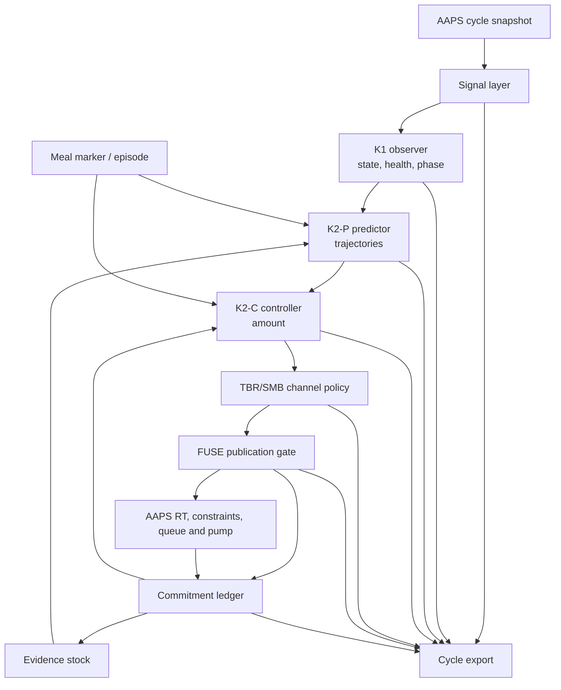

# FUSE architecture

This document describes the architecture implemented on the FUSE branches. It is a source-oriented guide, not a therapy guide and not a claim of clinical safety or efficacy.

Chapters 1-3 say what FUSE is and how one cycle is ordered; 4-13 follow that order layer by layer; 14-18 cover failure direction, delimitation, open work and the source map. Terms are defined once in the glossary and then used without further explanation.

> [!WARNING]
> FUSE is experimental insulin-dosing research software. Since 15.08.2026 it has been dosing a real pump (Medtrum Nano) for its single author; before that it ran only against VirtualPump. That is a change in exposure, not a change in maturity: one user, one pump model, one CGM, days of data, no second site, no independent review, no clinical evaluation. Pump eligibility is deliberately narrow and empirically justified - what is allowed is what has actually been run, not what shares a driver. Reading this document is not sufficient preparation for building or using it.

## 1. Scope and design target

FUSE is designed for a difficult operating point:

- one CGM value per minute;
- full closed loop without required carbohydrate or meal-bolus entry;
- early but bounded meal insulin;
- useful correction behavior outside meals;
- explicit protection against delayed insulin, over-commitment, sensor discontinuities, and long-tail insulin action;
- complete post-hoc reconstruction of each decision.

The one-minute cadence is a premise, not a preference. States, persistence rules, release windows and deadband windows are all defined on minute ticks. With a five-minute source the architecture does not degrade gracefully; it loses its basis.

What happens today with entered carbohydrates and manual boluses: their physical consequence is used wherever AAPS exposes it - a manual bolus raises IOB and therefore tightens every headroom limit and the tail calculation. What they do NOT do is declare a meal: they create no marker, no episode and no release envelope. The formal HCL/FCL semantics are open (chapter 16); the physics are not ignored in the meantime.

Structure is durable, numbers are tuning knobs. Many constants quoted in this document are explicitly alpha hypotheses in the source and are meant to be swept, not cited as design decisions. Where a number is a derivation rather than a setting, the text says so.

The project is **FCL-first**, not FCL-only by assumption. AAPS may still contain entered carbohydrates, manual boluses, temporary targets, and profile changes. FUSE currently incorporates their physical consequences where AAPS exposes them—for example, a manual bolus contributes to IOB—but the final HCL/FCL transition contract is still open. No documentation should imply otherwise.

## 2. What the name means

**FUSE** stands for **Full-loop Unannounced-disturbance Safety & Exposure Controller**.

- **Full-loop**: the target workflow does not require a meal bolus or carbohydrate announcement.
- **Unannounced disturbance**: the controller estimates a signed glucose disturbance rather than equating every rise with a meal. An unannounced disturbance is anything that pushes glucose up without anyone telling the loop: a meal, but equally stress, an infection, a bad infusion site, or sensor drift. FUSE deliberately does not try to label the cause; it estimates one signed number and treats every cause the same way.
- **Safety**: signal validity, trajectory guards, long-tail liability, pump eligibility, and ledger integrity are explicit contracts.
- **Exposure**: decisions are bounded and reconciled in insulin units across proposal, publication, transport, treatment visibility, and IOB - and, since 15.08.2026, also in the opposite direction: an amount proven never to have been sent is released again (chapter 11).
- **Controller**: FUSE produces an AAPS APS result; it is not merely a viewer, ISF modifier, or shadow evaluator.

The ordinary meaning also fits: FUSE combines (“fuses”) signal, profile, insulin action, state, and user context, while its fail-closed gates behave like electrical fuses when an invariant cannot be established.

## Words this document uses

| Term | In one sentence |
|---|---|
| K1 / K2-P / K2-C | Stage names from the internal specification: K1 observes the state, K2-P predicts the trajectory, K2-C decides the amount. Nothing depends on the letters; read them as observer, predictor, controller. |
| drive (`r`) | The estimated speed, in mg/dl per minute and signed, at which something other than the known insulin is moving glucose. It is what is left of the observed rate once the calculated effect of the insulin on board is taken out. |
| causal filter | A filter that uses only past values. Common CGM smoothers look at both sides of a point - more accurate in hindsight, but late, which a one-minute loop cannot afford. |
| trajectory / lower path | The predictor emits a curve, minute by minute, in more than one version. The lower path is the pessimistic one; every safety check reads it and only it. |
| prior-free path | The same curve computed on the assumption that the current rise stops right now. It answers: if the food is already over, is this amount still safe? |
| unit-insulin kernel | The activity curve of exactly one unit over time, sampled from the AAPS insulin model already configured. FUSE brings no insulin model of its own. |
| guard floor | The lowest value the pessimistic curve may reach inside the near horizon. |
| tail liability | What insulin will still do after the guard's horizon (chapter 9). |
| capIOB | `max(netIOB, bolusIOB)` - the IOB figure the dose caps read (chapter 7). |
| iobTH | The boundary between the fast channel (SMB) and the slow channel, not a total ceiling: above it the SMB channel closes while basal continues. |
| liability | An amount FUSE has handed over and must keep counting against itself until a written fact resolves it - either delivery or proof that it never left. |
| commitment ledger | The persistent store that owns those liabilities across cycles and restarts (chapter 11). |
| published | Handed over into the AAPS result. Not a network publication. |
| transport | The path from FUSE's decision to the pump command. |
| gate | Several checks are called gates and sit at different points: the pump gate asks whether FUSE may dose on this pump at all; the candidate gate asks whether this amount may stand given the pessimistic curve; the publication gate asks whether the amount may leave FUSE, and writes it to disk before it does; health gates ask whether the inputs allow any decision. |
| marker | One button press declaring an incoming meal. Not a carb estimate, no COB (chapter 8). |
| release envelope (Huelle, Vorschuss) | A fixed number of units a declared meal may spend in advance, before the rise has proved anything: consumable, exported, restart-safe. |
| episode | The bookkeeping unit a marker press opens; it outlives the marker's special rights (chapters 8 and 8.1). |
| evidence credit | Drive licence bought with new measured, BGI-adjusted disturbance that insulin has not yet paid for (chapter 8.1). |
| deadband | A band around target inside which FUSE deliberately does not chase small unannounced deviations (chapter 7). |
| HCL / FCL | Hybrid closed loop - the ordinary AAPS mode where you announce carbs and/or bolus yourself - versus full closed loop, where you do not. |

## 3. Layering



The cycle order is implemented in [`FuseCycleRunner`](fuse/plugin/src/main/kotlin/app/aaps/fuse/plugin/FuseCycleRunner.kt):

1. signal;
2. state;
3. trajectory;
4. amount;
5. actuation channel.

Within step 4, the amount passes a fixed chain of stages, and the order is part of the contract: base ratio, candidate search, candidate gate, prime release lift, marker floor, ledger hold gate, sub-step accumulation, TBR translation, publication gate. Every stage may only reduce the amount, with exactly two documented exceptions that lift it - the prime release and the marker floor, both of which require an explicit human authorization and are themselves bounded. No stage may invent a missing input or bypass a failed safety prerequisite. The stage that last touched the caps is exported by name (`base`, `candidate`, `prime`, `subStep`), so 'why 0.2 U?' is answered from the record rather than reconstructed.

The runner constructs one coherent cycle snapshot. Pump type, profile, IOB, signal time, and treatment view must not be independently re-read halfway through a decision because two individually valid reads can describe different physical moments. The snapshot is assembled and checked in [`CycleAssembly.kt`](fuse/core/src/main/kotlin/app/aaps/fuse/core/adapter/CycleAssembly.kt) and [`CoreInputGuard.kt`](fuse/core/src/main/kotlin/app/aaps/fuse/core/adapter/CoreInputGuard.kt); `CycleAssemblyTest`, `CoreInputGuardTest` and `CycleIobValidityTest` hold the guarantee.

## 4. Signal layer

Relevant code:

- [`UkfQ1.kt`](fuse/core/src/main/kotlin/app/aaps/fuse/core/signal/UkfQ1.kt)
- [`SignalWindow.kt`](fuse/core/src/main/kotlin/app/aaps/fuse/core/signal/SignalWindow.kt)
- [`SignalTimeGate.kt`](fuse/core/src/main/kotlin/app/aaps/fuse/core/signal/SignalTimeGate.kt)
- [`PairSlopeBand.kt`](fuse/core/src/main/kotlin/app/aaps/fuse/core/signal/PairSlopeBand.kt)
- [`PostGapMetrics.kt`](fuse/core/src/main/kotlin/app/aaps/fuse/core/signal/PostGapMetrics.kt)
- [`BgiAdjustedSeries.kt`](fuse/core/src/main/kotlin/app/aaps/fuse/core/signal/BgiAdjustedSeries.kt), including the checked `BgiAdjustedSeries.AdjustedInterval` type
- [`FuseSignalSource.kt`](fuse/plugin/src/main/kotlin/app/aaps/fuse/plugin/FuseSignalSource.kt)

The signal layer maintains separate meanings for:

- raw CGM;
- causal Q1-filtered glucose;
- robust signed glucose rate;
- insulin activity/BGI-adjusted disturbance;
- source timestamp and compute timestamp;
- gaps, discontinuities, and post-gap jumps.

Q1 is the in-house name of the causal one-minute filter; the point is the word causal, not the label - only past values enter it, so its output could have been produced in real time.

FUSE does not repair missing data by inventing a flat line, a zero rate, or a fresh timestamp. A missing or stale prerequisite is a named health reason and normally leads to a fail-closed cycle.

The robust rate is derived from slope pairs over a causal window. Its distribution is exported because a single median without spread would conceal whether the estimate is stable or supported by only a few pairs.

The BGI-adjusted series does not hand out loose numbers: a checked interval is a type (`BgiAdjustedSeries.AdjustedInterval`), not a convention. That is what makes it impossible for the same measurement point to produce evidence twice - a rule chapter 8.1 depends on and could not enforce on its own.

## 5. K1 observer: state is not dose

Relevant code:

- [`ObserverStateMachine.kt`](fuse/core/src/main/kotlin/app/aaps/fuse/core/observer/ObserverStateMachine.kt)
- [`ObserverTypes.kt`](fuse/core/src/main/kotlin/app/aaps/fuse/core/observer/ObserverTypes.kt)

The observer has three orthogonal axes:

| Axis | Examples | Meaning |
|---|---|---|
| Health | `READY`, `WARMUP`, `DEGRADED` plus reasons | Are the inputs usable? |
| Safety | `LOW` | Is there a directly observed safety state? |
| Phase | see the phase table below | What dynamic episode is being observed? |

| Phase | Meaning |
|---|---|
| `REARMING` | After a reset or an ended episode: nothing is tracked, quiet time has to accumulate before a new rise can be detected. |
| `ARMED` | Quiet, watching. |
| `CANDIDATE` | The rate has just crossed the rise threshold but is not confirmed; falling back below the threshold aborts straight to `REARMING`. |
| `RISE_ACTIVE` | The rise is confirmed and the event window is running. |
| `CARRY` | The event window has expired while the rate is still above threshold - the rise is lasting longer than the window it was budgeted for. |
| `TURN` | The peak is behind and glucose is coming down while most of the insulin already given has not acted yet. |

This separation avoids states such as “rising and low and stale” being collapsed into one enum where one fact can erase another. The observer emits state and provenance; it does not directly calculate insulin.

## 6. K2-P predictor: time-indexed trajectories

Relevant code:

- [`TrajectoryCore.kt`](fuse/core/src/main/kotlin/app/aaps/fuse/core/predictor/TrajectoryCore.kt)
- [`K2PTypes.kt`](fuse/core/src/main/kotlin/app/aaps/fuse/core/predictor/K2PTypes.kt), including `minSafetyLowerOf` and `minSafetyHorizonLowerOf`
- [`DriveDecayModel.kt`](fuse/core/src/main/kotlin/app/aaps/fuse/core/predictor/DriveDecayModel.kt)
- [`ConditionalDrive.kt`](fuse/core/src/main/kotlin/app/aaps/fuse/core/predictor/ConditionalDrive.kt)
- [`DriveDiscount.kt`](fuse/core/src/main/kotlin/app/aaps/fuse/core/predictor/DriveDiscount.kt)
- [`TrajectoryQuery.kt`](fuse/core/src/main/kotlin/app/aaps/fuse/core/predictor/TrajectoryQuery.kt)
- [`Canonical.kt`](fuse/core/src/main/kotlin/app/aaps/fuse/core/predictor/Canonical.kt)
- [`UnitInsulinKernel.kt`](fuse/core/src/main/kotlin/app/aaps/fuse/core/insulin/UnitInsulinKernel.kt)

The predictor does not produce one predicted BG. It produces a curve, minute by minute, and more than one version of that curve. The lower path is the pessimistic version. Every safety check reads the lower path and only the lower path; display and demand may read the main path. The rule that keeps this honest is that no calculation may quietly swap a more favourable curve into a safety question.

The predictor produces a trajectory rather than a single predicted BG. Its inputs include:

- current signal and signed drive;
- scheduled profile ISF slots over the future horizon;
- the AAPS insulin model sampled as a unit-insulin kernel;
- current IOB and pending transport exposure;
- an optional fast-restraint path;
- optional declared meal drive while a marker credit is active.

The main and restraint paths remain separate. Safety checks use the pessimistic applicable lower path; display and demand calculations must not silently substitute a more favorable trajectory.

A declared meal changes what the predictor assumes about the incoming disturbance, but it does not enter the safety trajectory at all. Guard, clearance and tail certificates are computed against a point-wise prior-free twin path (`PredictorResult.minLowerBgPriorFree`, `minSafetyLowerBg`, `minSafetyLowerOf`), so an authorization can never make the safety curve look better than it is. The earlier approach - keeping one path and subtracting an analytic correction for the prior - was withdrawn as incomplete; the remaining `priorLiftAtHorizonMgdl` is display only.

One correction runs on the lower path only: the drive estimate can read the controller's own insulin activity as evidence of a larger disturbance, which at night closes a loop between braking and dosing. The bolus-coverage discount removes that share. It is deliberately one-sided - it can only make doses smaller - and it is applied to the lower path, never to the display path.

## 7. K2-C controller: select, then certify

Relevant code:

- [`FuseController.kt`](fuse/core/src/main/kotlin/app/aaps/fuse/core/controller/FuseController.kt)
- [`CandidateSearch.kt`](fuse/core/src/main/kotlin/app/aaps/fuse/core/controller/CandidateSearch.kt)
- [`CandidateGate.kt`](fuse/core/src/main/kotlin/app/aaps/fuse/core/controller/CandidateGate.kt)
- [`PrimeRelease.kt`](fuse/core/src/main/kotlin/app/aaps/fuse/core/controller/PrimeRelease.kt)
- [`MarkerFloor.kt`](fuse/core/src/main/kotlin/app/aaps/fuse/core/controller/MarkerFloor.kt)
- [`SubStepAccumulator.kt`](fuse/core/src/main/kotlin/app/aaps/fuse/core/controller/SubStepAccumulator.kt)
- [`NightWindow.kt`](fuse/core/src/main/kotlin/app/aaps/fuse/core/controller/NightWindow.kt)
- [`IobThreshold.kt`](fuse/core/src/main/kotlin/app/aaps/fuse/core/controller/IobThreshold.kt)
- [`EvidenceStock.kt`](fuse/core/src/main/kotlin/app/aaps/fuse/core/controller/EvidenceStock.kt)
- [`LedgerHoldGate.kt`](fuse/core/src/main/kotlin/app/aaps/fuse/core/controller/LedgerHoldGate.kt)

The controller separates four questions:

1. Is there a modelled insulin requirement?
2. Which candidate amount satisfies the trajectory?
3. Which limits bind the final amount?
4. Through which channel may the result be expressed?

Every exported cycle answers these four questions in this order, which is also the order in which a trail line is read.

The candidate search evaluates candidate-dependent trajectory effects. This cannot be replaced by applying a list of scalar caps after the fact: the lower path itself changes with candidate size.

The final amount is checked against three kinds of limit: what the glucose curve allows (the near-horizon guard floor and the long-horizon tail liability); what the insulin budget allows (per-cycle `maxSMB`, iobTH and maxIOB headroom against `capIOB`, and amounts already handed over but not yet visible); and what the situation allows (pump increment and sub-step accumulation, episode release envelopes, deadbands, health and validity gates). Limits apply to the final amount, not to independently added dose channels. The binding limit - the one that actually cut the amount - is exported by name every cycle.

In detail:

- per-cycle `maxSMB`;
- iobTH headroom;
- maxIOB headroom;
- persistent transport commitment;
- near-horizon guard floor;
- long-horizon tail liability;
- episode-specific release envelopes;
- pump increment and sub-step accumulation;
- contextual deadbands and health/validity gates.

### capIOB versus net IOB

With a zero temp running, AAPS basal IOB goes negative. That is correct bookkeeping - it records insulin not given relative to the profile. But if the dose budget were measured against net IOB, withholding basal would silently create room for a bolus: the loop would reward itself for having braked, and the harder it braked the more it would be allowed to give. FUSE therefore measures the iobTH and maxIOB headroom against

```text
capIOB = max(netIOB, bolusIOB)
```

Net IOB is still calculated, exported and displayed; it is simply not the number the caps read. iobTH itself is the boundary between the fast channel and the slow one, not a total ceiling: above it the SMB channel closes while basal continues. Its conversion happens exactly once, and the formula identity is exported (`IobThreshold.FORMULA_ID`); the autoISF legacy formula is deliberately not inherited.

### Deadbands

Two deadbands keep FUSE from chasing small unannounced deviations. The rebound deadband applies after a low, when a rise is the expected consequence of the low itself; the night deadband applies inside a configurable night window, where the error mode is a phantom demand created by the loop's own withheld basal and where nobody is awake to correct it. The effective deadband is the LARGER of the two - two protective reasons must never soften one another.

Both can be disarmed, and the two paths differ deliberately: a declared meal lifts the night deadband but not the rebound one; evidence credit flowing in this cycle (chapter 8.1) disarms both. The justification is that both deadbands exist to suppress unannounced small deviations, while evidence credit only exists inside an episode a human opened and only for disturbance that was measured, sealed, and not yet paid for with insulin. Without credit - dormant, suspended, pending seal, revoked, or under a ledger hold - both apply unchanged. The `evidenceCreditActive` parameter has no default value on purpose: a forgotten wiring must fail to compile rather than leave the deadbands quietly armed inside a meal window.

## 8. Meal handling and manual authorization

Relevant code:

- [`MarkerTimeline.kt`](fuse/core/src/main/kotlin/app/aaps/fuse/core/controller/MarkerTimeline.kt)
- [`MarkerEpisode.kt`](fuse/core/src/main/kotlin/app/aaps/fuse/core/controller/MarkerEpisode.kt)
- [`MarkerEpisodeGate.kt`](fuse/core/src/main/kotlin/app/aaps/fuse/core/controller/MarkerEpisodeGate.kt)
- [`MarkerScope.kt`](fuse/core/src/main/kotlin/app/aaps/fuse/core/controller/MarkerScope.kt)
- [`MarkerFloor.kt`](fuse/core/src/main/kotlin/app/aaps/fuse/core/controller/MarkerFloor.kt)
- [`MarkerFallback.kt`](fuse/core/src/main/kotlin/app/aaps/fuse/core/controller/MarkerFallback.kt)
- [`MarkerPrompt.kt`](fuse/core/src/main/kotlin/app/aaps/fuse/core/controller/MarkerPrompt.kt)
- [`OnsetChannel.kt`](fuse/core/src/main/kotlin/app/aaps/fuse/core/controller/OnsetChannel.kt)
- [`PrimeRelease.kt`](fuse/core/src/main/kotlin/app/aaps/fuse/core/controller/PrimeRelease.kt)

FUSE exposes exactly one meal control: a marker. It is not a carbohydrate estimate and creates no COB. Pressing it offers three choices, and the third is new: declare the meal WITH the advance release; declare it WITHOUT advance release; or withdraw the marker. 'Without advance release' means the meal window, the ramps and the deadband openings still apply, but the release envelope funds nothing - it is carried as its own fact (`MealMarkerNoPrime` -> `declinedByUser` -> plan reason `USER_NO_PRIME`) rather than as a zero envelope, so 'declined' stays distinguishable from 'spent' (`ENVELOPE_SPENT`) in the record.

The contract is amount-based:

- one configured envelope in insulin units, default 1.2 U, configurable up to 4 U;
- a consumable remainder and a per-cycle maximum;
- a deliverable release window, configurable from 5 to 45 minutes (default 15), inside a hard wall-clock ceiling of 45 minutes;
- restart-safe accounting in the ledger;
- withdrawal ends the authorization and the credit immediately, but not the episode and not the bookkeeping;
- no claim that already delivered insulin can be reversed - the dialog says so.

Withdrawal deliberately does not reset the books. Ending the episode as well would let 'press by mistake, withdraw, press properly' fund the envelope a second time. Identity and revocation are therefore separate facts (`MarkerEpisode.startsNewEpisode`, `MarkerEpisodeGate.creditRevoked`, and the permanently consumed anchor `lastConsumedMarkerTs`).

The advance release is spread over the window instead of being delivered at once. The reason is measured: the same amount delivered inside a few minutes produced an IOB peak that then blocked the guard for hours - precisely while absorption was arriving. Spreading gives the same head start with a lower peak at the moment it matters.

The marker-authorized amount can coexist with a protective zero TBR. That required giving the SMB block cause a type: a safety-zero model judgment can be overridden for the marker-funded amount, while pump busy, invalid input, missing snapshot, fake extended bolus, ledger failure, or transport failure cannot (chapter 10).

The authorization contract has four parts, and each is a floor rather than a skipped check:

- **MarkerFloor** sets a minimum at the END of the model chain, so an authorization raises a result rather than bypassing a test;
- **MarkerFallback** makes exactly two predictor reasons overridable (`ARRAY_TOO_SHORT`, `PENDING_MODEL_TOO_SHORT` - both statements about horizon coverage); eight other predictor reasons are not;
- **PrimeRelease.lift** deliberately skips the tail cap under explicit authorization, because that cap falls to zero at low BG and would otherwise null the marker-funded share entirely - an exception of this weight must not live only in a source comment;
- **the typed SMB block cause** (chapter 10) decides which block a human may override at all.

The dividing line is not dangerous versus harmless, it is who knows better. The human knows about the food; the model does not. The human knows nothing about the pump, the transport path, the ledger or a missing measurement, so those are never overridable.

The marker's special rights and the marker as CONTEXT are not the same duration. The boost ends with the sustained turn and at the latest after 45 minutes (configurable 0-90); the onset channel treats a marker as context for 90 minutes; the episode itself runs far longer (chapter 8.1).

Six named denials distinguish cases that require different human reactions. `MARKER_ALREADY_CONSUMED` - do nothing, the press was counted. `MARKER_CLOCK_ROLLBACK` - pressing again does NOT help. `MARKER_EVENT_NOT_DURABLE` - the UI shows 'marker active' while no credit exists, which is the one case a user must be able to recognize.

This is the most consequential experimental path in FUSE. It has run on a real pump since 15.08.2026 for a single user; that is exposure, not validation. The following are not yet closed:

- hand-off from the early release into confirmed meal absorption;
- large and slowly absorbed meals;
- false-marker live behavior;
- formal interaction with entered carbs and manual boluses;
- switching between FCL and HCL behavior.

### 8.1 Evidence stock

Relevant code: [`EvidenceStock.kt`](fuse/core/src/main/kotlin/app/aaps/fuse/core/controller/EvidenceStock.kt).

The marker buys a head start. The question the head start creates is what funds the meal afterwards - and the measured answer was: nothing did. After the release window the early dose itself pushed the safety trajectory under the guard floor, so the controller went quiet exactly while absorption arrived. The early dose makes FUSE blind to the very rise it was meant to anticipate.

The fix is not a fourth pot of insulin. A new budget behind the same gates would block in the same way; what was missing is not budget but a different disturbance assumption. The evidence stock therefore feeds the trajectory (`ConditionalDrive`) and then passes through every amount limit unchanged.

What may fund it is narrow on purpose:

- **income** is only NEW measurement information - the increase of the BGI-adjusted series since the last accounted source timestamp, each measurement point exactly once. The drive `r` is the evidence, not the money: `r` stays positive for several minutes after a turn, so an `r`-funded stock would keep financing an absorption that is already over, and at sixty cycles an hour the same observed disturbance would be booked sixty times;
- **deduction** is the insulin the episode has already committed, carried cumulatively so it can neither be deducted twice nor lost;
- **decay** runs on the wall clock, not on measurement points: during a signal gap the stock keeps decaying while both income and payout are blocked;
- **credit** is only ever drawn from the SEALED share, which costs one cycle of delay and is the price of not paying for an observation twice;
- **hard stop** at a six-hour episode cap, which is an emergency brake and explicitly not a model of meal duration - a stock fed by a rising adjusted series could otherwise grow indefinitely, and counter-regulation, sensor drift and a bad infusion site all look like disturbance without being a meal.

Seven phases are reported and they mean different things on purpose: `NONE`, `ACTIVE` (may deliver credit now), `PENDING_SEAL` (evidence has just arrived and is not sealed yet - calling this dormant would state the opposite of the truth), `DORMANT` (the meal is over for now; a later wave can reactivate the episode without restarting its clock or budget), `SUSPENDED` (blocked by a low, by health, or by revocation - not a judgement about the meal), `UNKNOWN`, `EXPIRED`. Eleven named no-inflow reasons say why nothing was booked. Phase, episode identity, age and cap are exported every cycle.

The stock is why the deadbands can be disarmed inside a meal window (chapter 7) without hollowing out their justification.

One limitation is structural, not incidental: the algebra that keeps a dose from funding itself holds only in a CLOSED loop. On a two-device test rig, where the insulin that actually acts comes from another device, nothing cancels and the stock is quantitatively unusable. Structure yes, numbers no. Its four tuning knobs are named and individually passable so a replay can sweep them; they are alpha hypotheses, not derivations - only the decay time has a real derivation behind it.

## 9. Tail liability

Relevant code: [`TailLiability.kt`](fuse/core/src/main/kotlin/app/aaps/fuse/core/controller/TailLiability.kt).

The guard looks a short way ahead - far enough to catch what a dose does soon, not far enough to catch what it does at the end. The tail check therefore asks a different question at a far horizon: what is unavoidably still on board when the near view has long since ended?

The near-horizon guard does not see insulin action that remains unavoidable after its horizon. The tail guard therefore accounts for three terms at the liability horizon:

1. residual effect of existing IOB;
2. residual effect of published but not yet visible transport commitment;
3. residual effect of the candidate being certified.

If an insulin kernel cannot be established, unknown residual effect is bounded conservatively by the full amount rather than replaced with zero. Completeness is exported (`3/3`, bounded, or missing terms), so a consumer can distinguish a calculated result from an upper bound.

`3/3` means all three terms could actually be calculated; a lower count or a bounded flag tells a consumer that it is reading an upper bound, not a computed result. That distinction is the whole point of exporting completeness at all.

There is exactly one exception. Under explicit manual authorization the tail cap is skipped in `PrimeRelease.lift`, because at low BG it falls to zero and would otherwise null the marker-funded share completely. The exception is bounded by the envelope and by the marker floor; it does not extend to transport, ledger or pump failures.

## 10. SMB and TBR channel policy

Relevant code:

- [`TbrPolicy.kt`](fuse/core/src/main/kotlin/app/aaps/fuse/core/controller/TbrPolicy.kt)
- [`FuseTbrTranslator.kt`](fuse/plugin/src/main/kotlin/app/aaps/fuse/plugin/FuseTbrTranslator.kt)
- [`FuseAbortTbr.kt`](fuse/plugin/src/main/kotlin/app/aaps/fuse/plugin/FuseAbortTbr.kt)

FUSE intentionally has no positive TBR channel:

- SMB is the positive, minute-granular insulin channel;
- a safety condition may request a real zero TBR;
- “no new positive insulin” may cancel an existing positive TBR while preserving an existing negative/zero TBR;
- fake-extended-bolus representations are read-only where FUSE cannot safely cancel them;
- a protective zero temp is ended as soon as its reason is demonstrably gone in this cycle.

Ending a zero early needs three facts at once: the switch is on (`TbrEndZeroWhenReasonGone`, default on), the caller has proven for THIS cycle that the protective reason is gone (`FuseTbrTranslator.reasonGone`: no ledger hold, no rebound window, block in {`NO_DEMAND`, `MAX_IOB_REACHED`, `IOB_TH_REACHED`}), and a real zero is actually running. The only outcome of that path is a cancel - a fall back to profile basal. It can never produce a positive rate. Because a failing cancel would otherwise be retried every minute on a pump that is already unhappy, it gives up after three unsuccessful attempts and lets the zero expire; the resulting error direction is then the old one, too little basal, not a new one. Both outcomes are named in the trail (`NO_POSITIVE_END_ZERO_REASON_GONE`, `NO_POSITIVE_END_ZERO_BACKOFF`). The motivation was measured, not theoretical: a protective zero regularly outlived its reason by a long stretch of each night.

Three further rules carry the channel policy:

- What counts as 'zero' is an absolute tolerance, not a relative one (`ZERO_RATE_TOL_MAX_UPERH = 0.025` U/h). A FOREIGN reduction must never be read as a zero and cancelled, because cancelling a reduction is an insulin increase by doing nothing.
- A zero of FUSE's own that has gone stale is cancelled in a dosing cycle (`KEEP_CANCEL_STALE_ZERO`), which is a different fact from the reason-gone exit and is named differently.
- If a positive SMB falls in the same cycle, the withholding stays and the cancel is dropped (`C7A_SMB_KEEPS_WITHHOLD`). Loosening the brake and pressing the accelerator in one cycle is never the intended combination.

The SMB block reason has a TYPE, not a free-text string: `NONE`, `SAFETY_ZERO`, `PUMP_BUSY`, `INVALID_INPUT`, `SAFETY_SNAPSHOT_MISSING`, `FAKE_EXTENDED`, `FAULT`. Exactly one of them - `SAFETY_ZERO`, a model judgement - can be overridden by manual authorization. The others are not judgement calls; they are statements that the machinery is not in a fit state to dose. This typing is what makes chapter 8 possible at all.

The correction-path review has since been carried out; it produced the early exit from a protective zero described above. What remains open is only the positive TBR itself - whether a slow positive rate improves sub-increment corrections and deadband behaviour without creating an undesirable 30-minute commitment. Until that is decided, documentation must not claim the correction architecture is finished.

## 11. Persistent commitment ledger

Relevant code:

- [`LedgerTypes.kt`](fuse/core/src/main/kotlin/app/aaps/fuse/core/ledger/LedgerTypes.kt)
- [`LedgerReducer.kt`](fuse/core/src/main/kotlin/app/aaps/fuse/core/ledger/LedgerReducer.kt)
- [`NotSentProof.kt`](fuse/core/src/main/kotlin/app/aaps/fuse/core/ledger/NotSentProof.kt)
- [`DeliveryJournal.kt`](fuse/core/src/main/kotlin/app/aaps/fuse/core/journal/DeliveryJournal.kt) and [`DeliveryJournalTypes.kt`](fuse/core/src/main/kotlin/app/aaps/fuse/core/journal/DeliveryJournalTypes.kt)
- [`LedgerHoldGate.kt`](fuse/core/src/main/kotlin/app/aaps/fuse/core/controller/LedgerHoldGate.kt)
- [`FuseLedgerAdapter.kt`](fuse/plugin/src/main/kotlin/app/aaps/fuse/plugin/ledger/FuseLedgerAdapter.kt)
- [`FuseLedgerStore.kt`](fuse/plugin/src/main/kotlin/app/aaps/fuse/plugin/ledger/FuseLedgerStore.kt)
- [`LedgerPublicationGate.kt`](fuse/plugin/src/main/kotlin/app/aaps/fuse/plugin/ledger/LedgerPublicationGate.kt)
- [`LedgerCodec.kt`](fuse/plugin/src/main/kotlin/app/aaps/fuse/plugin/ledger/LedgerCodec.kt)
- [`LedgerStateValidator.kt`](fuse/plugin/src/main/kotlin/app/aaps/fuse/plugin/ledger/LedgerStateValidator.kt)
- [`Durability.kt`](fuse/plugin/src/main/kotlin/app/aaps/fuse/plugin/ledger/Durability.kt)
- [`FuseLedgerRepair.kt`](fuse/plugin/src/main/kotlin/app/aaps/fuse/plugin/ledger/FuseLedgerRepair.kt)
- [`FuseRepairScheduler.kt`](fuse/plugin/src/main/kotlin/app/aaps/fuse/plugin/ledger/FuseRepairScheduler.kt)
- [`LedgerDirMigration.kt`](fuse/plugin/src/main/kotlin/app/aaps/fuse/plugin/ledger/LedgerDirMigration.kt)
- [`FuseHoldAlarm.kt`](fuse/plugin/src/main/kotlin/app/aaps/fuse/plugin/FuseHoldAlarm.kt)

The pump can execute a bolus before AAPS sees it as a treatment. Inside that window FUSE must count the amount against itself, or it finances the same units twice. Measured visibility latency is usually under a minute but has outliers well past ten. That is the whole reason the ledger exists.

AAPS treatment visibility can lag pump requests. FUSE cannot interpret “not visible yet” as “not delivered”. The ledger therefore tracks proposal and accounting state across cycles and process restarts.

Key rules:

- a published amount remains liable until a terminal or accounting fact resolves it;
- unknown is never converted to zero;
- positive evidence can increase or preserve liability, not silently erase it;
- treatment identity and pump epoch prevent cross-device or cross-patch reconciliation;
- migration, corruption, and contradictory evidence enter a visible hold;
- repair is explicit, recorded, and applied at a cycle boundary.

### Releasing a liability that never left

The opposite error is just as real: FUSE decided a bolus, booked it, and the command never reached the pump. Until 15.08.2026 the line then stood as a liability until it aged out - insulin-day plus two hours - and until then FUSE dosed as if insulin were on board that had never flowed.

The release path therefore reads three WRITTEN facts, never a timeout: FUSE's own publication gate stripped the amount and sealed that decision (`GATE_BLOCKED`); AAPS constrained the amount to exactly zero (`CONSTRAINT_ZERO`); or the apply block that commands a bolus was demonstrably never entered while an amount was still outstanding (`BOLUS_IN_QUEUE`). Nothing counts unless the previous run can be identified as the same run, and a failed seal proves nothing at all - the safe default is that the liability stays.

A timeout is not evidence that nothing was delivered; it is the absence of an observation. The two directions are not symmetric: too much liability means FUSE doses too little, which is unpleasant; too little liability means it doses too much, which is dangerous.

The ledger is the only owner of amount liability. The transport journal and treatment evidence provide state/provenance; their quantities are not independently added to IOB again.

Besides amounts, the ledger carries the entire meal bookkeeping, restart-safe: prime window start, committed evidence, episode identity, the permanently consumed marker anchor, the revocation flag, the persisted evidence stock, and a pending reservation whose three states (`RESERVED`, `REQUESTED`, `REJECTED`) decide whether an amount stays booked or is released.

A hold does not merely stop the candidate search. Two amount-producing paths bypass a candidate reject - the ratio path when the insulin kernel fails, and the advance release, which lifts after the candidate gate on purpose. The ledger hold gate therefore sits behind all stages of the amount chain (chapter 3) and zeroes without compromise. On the TBR axis it applies 'no new positive': running zero or negative temps stay, only a positive temp is ended. Blind braking and blind letting go are both wrong when the ledger by definition does not know what is out there.

The delivery journal records the transport path as named events - created, send attempt started, write accepted, write refused, temporary id observed, pump id observed, delivery confirmed, proven not sent, liability accounted - together with the ambiguity boundary and the source of a refusal. It supplies state and provenance; its quantities are never added to IOB a second time. Anyone who wants to understand why 'not visible' does not mean 'not delivered' reads this channel.

## 12. Pump boundary and AAPS-native actuation

Relevant code:

- [`FusePumpGate.kt`](fuse/plugin/src/main/kotlin/app/aaps/fuse/plugin/FusePumpGate.kt)
- [`FuseActivePump.kt`](fuse/plugin/src/main/kotlin/app/aaps/fuse/plugin/FuseActivePump.kt)
- [`FusePatchEpoch.kt`](fuse/plugin/src/main/kotlin/app/aaps/fuse/plugin/ledger/FusePatchEpoch.kt)
- [`FuseRtBuilder.kt`](fuse/plugin/src/main/kotlin/app/aaps/fuse/plugin/FuseRtBuilder.kt)

FUSE does not own pump communication. It builds an AAPS APS result and relies on the existing AAPS constraint, queue, driver, retry, and treatment pipeline.

The pump gate is an allowlist:

- VirtualPump is permitted as the development path, regardless of the pump model it emulates;
- the reviewed Medtrum Nano model has a distinct real-pump verdict;
- Medtrum 300U, unknown Medtrum variants, and every unrelated real pump remain blocked;
- the active pump object and model are sampled once per cycle.

The gate returns one of five verdicts: `ALLOWED` (VirtualPump, whatever model it emulates), `ALLOWED_REAL_MEDTRUM` (the reviewed Nano), `BLOCKED_UNPROVEN_MODEL` (a Medtrum that is not the reviewed model - blocked with its own reason rather than lumped in with foreign pumps), `BLOCKED_REAL_PUMP`, `BLOCKED_UNKNOWN_PUMP`. The allowlist is EMPIRICAL, not structural: Medtrum 300U shares the driver path and stays blocked because it has not been run. Everything not listed is blocked.

No FUSE-authored commit may change `pump/**`. This is checked by [`tools/check_fuse_pump_isolation.sh`](tools/check_fuse_pump_isolation.sh) and CI. The complete list of AAPS touchpoints is maintained in [`FUSE_UPSTREAM_PORTING_MATRIX.md`](FUSE_UPSTREAM_PORTING_MATRIX.md). A second static check, [`tools/check_fuse_ui_idioms.sh`](tools/check_fuse_ui_idioms.sh), guards UI idioms that unit tests structurally cannot reach.

One READING assumption about AAPS code exists outside the touchpoints listed in the matrix: the not-sent proof relies on `LoopPlugin` setting its pump placeholder only inside the apply block. The assumption is pinned by a static watcher test (`LoopPluginAnnahmeWaechterTest`) and must be carried in the porting matrix, because an assumption about foreign code is what breaks silently on the next merge.

Medtrum pumps are patch pumps: reservoir and pump electronics are replaced together every few days. FUSE persists a counter that increases with each new patch, so a dose proposed on the old patch can never be matched to a delivery recorded on the new one - the accounting cannot jump across the change. (This has nothing to do with software patches.) VirtualPump emulation is persisted as an explicit fact; it is never inferred later from the configured model name.

Fail-closed here means FUSE issues no new positive insulin and hands the decision back to the ordinary AAPS pipeline: profile basal keeps running, and a protective zero temp keeps running. It does not mean the pump stops.

## 13. Observability

Relevant code:

- [`FuseStateJson.kt`](fuse/plugin/src/main/kotlin/app/aaps/fuse/plugin/export/FuseStateJson.kt)
- [`FuseStateExporter.kt`](fuse/plugin/src/main/kotlin/app/aaps/fuse/plugin/export/FuseStateExporter.kt)
- [`FuseDashboardModel.kt`](fuse/plugin/src/main/kotlin/app/aaps/fuse/plugin/FuseDashboardModel.kt)
- [`FuseScreenModel.kt`](fuse/plugin/src/main/kotlin/app/aaps/fuse/plugin/FuseScreenModel.kt)
- [`FuseSettingsReport.kt`](fuse/plugin/src/main/kotlin/app/aaps/fuse/plugin/FuseSettingsReport.kt)
- [`FuseFragment.kt`](fuse/plugin/src/main/kotlin/app/aaps/fuse/plugin/FuseFragment.kt)
- [`FuseHoldAlarm.kt`](fuse/plugin/src/main/kotlin/app/aaps/fuse/plugin/FuseHoldAlarm.kt)
- [`FuseLowMemory.kt`](fuse/plugin/src/main/kotlin/app/aaps/fuse/plugin/FuseLowMemory.kt)
- [`FuseGraphMargin.kt`](fuse/plugin/src/main/kotlin/app/aaps/fuse/plugin/FuseGraphMargin.kt)

Every cycle writes a JSONL evidence record to `Documents/aapsLogs/fuse_state_history.jsonl`. The record includes, where applicable:

- build version, Git head, and committed/dirty provenance;
- source and compute timestamps;
- signal, phase, health, and reset causes;
- trajectory components and lower-path minima;
- calculated SMB/TBR and binding limit;
- iobTH/maxIOB headroom and `capIOB`;
- guard and tail components;
- marker state, episode spending, and authorization;
- evidence episode: identity, phase, age, cap, and the named no-inflow reason;
- night window and the effective deadband;
- the rule-set identity card: `policy.values`, `policy.hash`, `ruleSetVersion`;
- pump-gate verdict and real/virtual distinction;
- publication-gate result;
- ledger revision, open entries, and transport commitment;
- patch-epoch applicability and reason;
- named gaps instead of silently absent mandatory fields.

Each record carries `schemaVersion` (currently 4) and `ruleSetVersion` (currently 10), plus `ruleSetVersionIsManual: true`. The rule-set number is maintained by hand: an evaluation must not rely on it blindly, or it will treat two different rule sets as one. `policy.hash` over the actual configuration values is the machine-checkable half of that pair. A measurement window is only valid with one `build.head` AND one rule set.

The UI is a view of the same cycle state, not a second control source. The compact dashboard shows operational state first; the full technical trace remains available for diagnosis.

Day to day there is nothing to operate. FUSE runs as the APS plugin inside AAPS; home screen, pump, CGM source and notifications are unchanged. There is exactly one control - the meal marker with its three choices. Everything else is observation: a FUSE tab with the current cycle and a settings report that names any deviation between configured and effective values (rounding noise is explicitly not a deviation), and one JSON line per minute in the trail. A ledger hold raises its own alarm on its own notification channel, because a hold that nobody sees is the failure mode that already happened once.

The meal evaluator [`tools/fuse/mahlzeitenlauf.py`](tools/fuse/mahlzeitenlauf.py) rejects a window containing multiple build heads. This is essential because a live run that spans several APKs cannot establish which rules produced its outcome.

[`tools/fuse/blocker_entmaskieren.py`](tools/fuse/blocker_entmaskieren.py) answers which blocker was actually binding. A frequency count of block reasons is NOT a causal weighting: whichever check fires first masks every check behind it.

## 14. Failure direction

FUSE follows a repeated asymmetry:

| Ambiguity | Required direction |
|---|---|
| Missing IOB/profile/kernel | No invented zero; abort or conservative bound |
| Missing pump identity/epoch | Do not bind or publish positive SMB |
| Treatment not yet visible | Keep liability open |
| Failed persistence | Hold positive publication |
| Invalid signal/history | Named degraded/abort state |
| Unknown future effect | Upper-bound exposure rather than ignore it |
| Rejected local publication | Release only the amount proven not to have left FUSE |
| Human declares a meal | Model judgements overridable, bounded and named; pump, transport, ledger and missing-measurement facts never overridable |
| Amount proven never sent | Release the liability - but only against a written fact, never against a timeout |

The aim is not “always dose less”; it is “never create permission from missing evidence”. Manual authorization is the explicit exception where the user supplies information the model cannot observe. Even there, the authorization is quantified and does not open transport or integrity failures.

## 15. Differences from an autoISF extension

The difference in one sentence: FUSE decides HOW MANY UNITS to give and then tracks those units - from proposal, through the AAPS result and the pump command, until they appear as IOB - instead of adjusting a sensitivity factor and letting the dose fall out of it. Everything in this list follows from that. An amount can be checked against a limit, counted, held liable and reconstructed afterwards; a factor cannot.

FUSE is not implemented as another autoISF factor - autoISF being the AAPS extension that adjusts the effective insulin sensitivity by rule - because its responsibilities are different:

- time-indexed state and trajectories replace a single modified sensitivity as the central abstraction;
- meal onset, correction, carry, and turn are observable states rather than implicit factor combinations;
- safety is expressed through named amount and trajectory contracts;
- pending insulin is an explicit accounting state;
- one-minute cadence and pump increment accumulation are first-class;
- every decision is reconstructable without parsing human reason text;
- AAPS-native actuation is retained, so the new controller does not become a second pump stack;
- a bounded, human-authorized advance release with its own consumable envelope;
- an evidence stock that funds the trajectory from measured, unpaid disturbance;
- deadbands that are contextual and can be disarmed by evidence rather than by a clock;
- a persistent liability ledger that resolves in both directions.

Whether these differences produce better glucose outcomes must be established by controlled tests. The architecture makes those tests attributable; it does not pre-judge their result.

## 16. Current open work

### Closed since the first version of this document
- clean single-build meal runs (point 1) - carried out; the run is no longer the bottleneck;
- correction-path review (point 3) - carried out; it produced the early exit from a protective zero (chapter 10);
- FUSE tab and preference language (point 5) - rebuilt on 15.08.2026: five settings entry points, a slimmed tab, and a settings report.

### Open
- hand-off from the advance release into confirmed absorption at large and slowly absorbed meals - the evidence stock (chapter 8.1) is the mechanism, its four parameters are unswept alpha hypotheses;
- false-marker behaviour in life;
- formal FCL/HCL switching and the semantics of entered carbohydrates and manual boluses;
- whether a positive TBR is useful below SMB granularity or inside deadbands.

### Deliberately not built
- a positive FUSE TBR channel (chapter 10) - a current design boundary, not a settled proof that it is never useful;
- general pump support - the allowlist is empirical and stays that way;
- COB or any carbohydrate model.

### Versioning
The repository builds `3.4.2.5+fuse1.0.2-toni`. The `1.0.x` line means 'the author's own production line', not a release status: one user, one pump model, no independent review. Public milestones would need immutable tags plus explicitly defined production criteria; neither exists.

## 17. Source and test map

| Contract | Main implementation | Representative tests |
|---|---|---|
| Signal continuity and robust rate | `fuse/core/.../signal` | `SignalWindowTest`, `PairSlopeBandTest`, `PostGapMetricsTest` |
| Observer state machine | `fuse/core/.../observer` | observer tests under the same module |
| Predictor and trajectories | `TrajectoryCore`, `UnitInsulinKernel` | predictor/kernel tests |
| Candidate and caps | `FuseController`, `CandidateSearch`, `PrimeRelease` | controller, cap, marker-authorization tests |
| TBR semantics | `TbrPolicy`, `FuseTbrTranslator` | `TbrPolicyTest`, `FuseTbrTranslatorTest`, `FuseAbortTbrTest` |
| Ledger and migration | `LedgerReducer`, plugin ledger store/codec | ledger, codec, migration, persistence tests |
| Pump eligibility | `FusePumpGate` | `FusePumpGateTest`, `FuseActivePumpSnapshotTest` |
| Export completeness | `FuseStateJson` | `FuseStateExportTest` |
| Dashboard semantics | `FuseDashboardModel` | `FuseDashboardModelTest` |
| Marker episode and authorization | `MarkerEpisode`, `MarkerEpisodeGate`, `MarkerScope`, `MarkerFloor`, `MarkerFallback`, `MarkerPrompt` | `MarkerEpisodeGateTest`, `MarkerScopeTest`, `MarkerFloorTest`, `MarkerFallbackTest`, `MarkerPromptTest`, `MarkerAuthorizationTest` |
| Evidence stock | `EvidenceStock` | `EvidenceStockTest`, `EvidenceChainTest`, `DeclaredAbsorptionTest` |
| Deadbands | `NightWindow`, `FuseController` rebound constants | `NightWindowTest`, `ReboundWindowTest` |
| Zero-temp exit | `TbrPolicy`, `FuseTbrTranslator` | `TbrEndZeroTest`, `FuseTbrReasonGoneTest` |
| Not-sent proof | `NotSentProof` | `NotSentProofTest`, `LoopPluginAnnahmeWaechterTest` |
| Transport journal | `DeliveryJournal` | `DeliveryJournalTest`, `TransportWiringTest` |
| Ledger hold as last stage | `LedgerHoldGate` | `LedgerHoldGateTest` |
| Cycle snapshot coherence | `CycleAssembly`, `CoreInputGuard` | `CycleAssemblyTest`, `CoreInputGuardTest`, `CycleIobValidityTest` |
| UI semantics | `FuseScreenModel`, `FuseSettingsReport` | `FuseScreenModelTest`, `FuseSettingsReportTest` |

101 test classes and 1319 test methods run under `fuse/**` on the JVM. Tested here means covered by automated tests; it does not mean clinically evaluated and it does not mean observed to behave well in life. The user interface is the known weak spot: three defects were found by hand on the device on 10.08.2026 and none of them by the test suite of the day, which is why a static idiom watcher exists and why UI work counts as finished only after a look at the device.

CI runs the FUSE modules plus the AAPS modules containing unavoidable core changes. See [the workflow](.github/workflows/fuse-architecture-ci.yml) and [the porting matrix](FUSE_UPSTREAM_PORTING_MATRIX.md).

## 18. Branch discipline

`fuse-dev` is the moving integration branch. `3.4.2.5+fuse1.0.0-toni` is the PRODUCTION line: it is what loops on the real pump. `3.4.2.5+fuse0.1.0-toni` remains the frozen earlier line. Neither moving branch is immutable, and a branch name is not a version: the repository currently builds `3.4.2.5+fuse1.0.2-toni`. Only a Git tag identifies a frozen source commit, and a valid run additionally requires one exported `build.head` with `build.committed = true` for the entire measurement window.

Two carriers exist and must not be confused in a measurement: a development device with VirtualPump, and the production device with the real pump. A run from the development carrier cannot be quoted as real-pump behaviour, and in a two-device setup the evidence stock is quantitatively unusable (chapter 8.1).

Documentation-only commits move the repository head but do not change an already installed APK. They must not be mistaken for a new device build.
