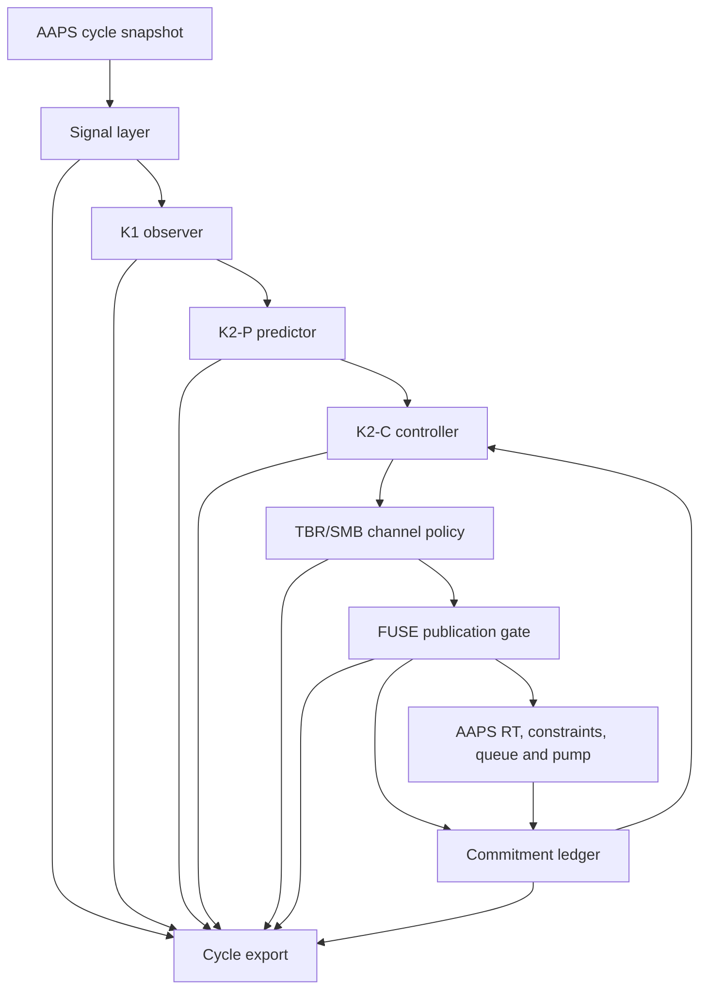

# FUSE architecture

This document describes the architecture implemented on the FUSE branches. It is a source-oriented guide, not a therapy guide and not a claim of clinical safety or efficacy.

> [!WARNING]
> FUSE is experimental insulin-dosing research software. The current implementation is an alpha test system with deliberately narrow pump eligibility. Reading this document is not sufficient preparation for building or using it.

## 1. Scope and design target

FUSE is designed for a difficult operating point:

- one CGM value per minute;
- full closed loop without required carbohydrate or meal-bolus entry;
- early but bounded meal insulin;
- useful correction behavior outside meals;
- explicit protection against delayed insulin, over-commitment, sensor discontinuities, and long-tail insulin action;
- complete post-hoc reconstruction of each decision.

The project is **FCL-first**, not FCL-only by assumption. AAPS may still contain entered carbohydrates, manual boluses, temporary targets, and profile changes. FUSE currently incorporates their physical consequences where AAPS exposes them—for example, a manual bolus contributes to IOB—but the final HCL/FCL transition contract is still open. No documentation should imply otherwise.

## 2. What the name means

**FUSE** stands for **Full-loop Unannounced-disturbance Safety & Exposure Controller**.

- **Full-loop**: the target workflow does not require a meal bolus or carbohydrate announcement.
- **Unannounced disturbance**: the controller estimates a signed glucose disturbance rather than equating every rise with a meal.
- **Safety**: signal validity, trajectory guards, long-tail liability, pump eligibility, and ledger integrity are explicit contracts.
- **Exposure**: decisions are bounded and reconciled in insulin units across proposal, publication, transport, treatment visibility, and IOB.
- **Controller**: FUSE produces an AAPS APS result; it is not merely a viewer, ISF modifier, or shadow evaluator.

The ordinary meaning also fits: FUSE combines (“fuses”) signal, profile, insulin action, state, and user context, while its fail-closed gates behave like electrical fuses when an invariant cannot be established.

## 3. Layering



The cycle order is implemented in [`FuseCycleRunner`](fuse/plugin/src/main/kotlin/app/aaps/fuse/plugin/FuseCycleRunner.kt):

1. signal;
2. state;
3. trajectory;
4. amount;
5. actuation channel.

The runner constructs one coherent cycle snapshot. Pump type, profile, IOB, signal time, and treatment view must not be independently re-read halfway through a decision because two individually valid reads can describe different physical moments.

## 4. Signal layer

Relevant code:

- [`UkfQ1.kt`](fuse/core/src/main/kotlin/app/aaps/fuse/core/signal/UkfQ1.kt)
- [`SignalWindow.kt`](fuse/core/src/main/kotlin/app/aaps/fuse/core/signal/SignalWindow.kt)
- [`PairSlopeBand.kt`](fuse/core/src/main/kotlin/app/aaps/fuse/core/signal/PairSlopeBand.kt)
- [`BgiAdjustedSeries.kt`](fuse/core/src/main/kotlin/app/aaps/fuse/core/signal/BgiAdjustedSeries.kt)
- [`FuseSignalSource.kt`](fuse/plugin/src/main/kotlin/app/aaps/fuse/plugin/FuseSignalSource.kt)

The signal layer maintains separate meanings for:

- raw CGM;
- causal Q1-filtered glucose;
- robust signed glucose rate;
- insulin activity/BGI-adjusted disturbance;
- source timestamp and compute timestamp;
- gaps, discontinuities, and post-gap jumps.

FUSE does not repair missing data by inventing a flat line, a zero rate, or a fresh timestamp. A missing or stale prerequisite is a named health reason and normally leads to a fail-closed cycle.

The robust rate is derived from slope pairs over a causal window. Its distribution is exported because a single median without spread would conceal whether the estimate is stable or supported by only a few pairs.

## 5. K1 observer: state is not dose

Relevant code:

- [`ObserverStateMachine.kt`](fuse/core/src/main/kotlin/app/aaps/fuse/core/observer/ObserverStateMachine.kt)
- [`ObserverTypes.kt`](fuse/core/src/main/kotlin/app/aaps/fuse/core/observer/ObserverTypes.kt)

The observer has three orthogonal axes:

| Axis | Examples | Meaning |
|---|---|---|
| Health | `READY`, `WARMUP`, `DEGRADED` plus reasons | Are the inputs usable? |
| Safety | `LOW` | Is there a directly observed safety state? |
| Phase | `REARMING`, `ARMED`, `CANDIDATE`, `RISE_ACTIVE`, `CARRY`, `TURN` | What dynamic episode is being observed? |

This separation avoids states such as “rising and low and stale” being collapsed into one enum where one fact can erase another. The observer emits state and provenance; it does not directly calculate insulin.

## 6. K2-P predictor: time-indexed trajectories

Relevant code:

- [`TrajectoryCore.kt`](fuse/core/src/main/kotlin/app/aaps/fuse/core/predictor/TrajectoryCore.kt)
- [`K2PTypes.kt`](fuse/core/src/main/kotlin/app/aaps/fuse/core/predictor/K2PTypes.kt)
- [`DriveDecayModel.kt`](fuse/core/src/main/kotlin/app/aaps/fuse/core/predictor/DriveDecayModel.kt)
- [`ConditionalDrive.kt`](fuse/core/src/main/kotlin/app/aaps/fuse/core/predictor/ConditionalDrive.kt)
- [`UnitInsulinKernel.kt`](fuse/core/src/main/kotlin/app/aaps/fuse/core/insulin/UnitInsulinKernel.kt)

The predictor produces a trajectory rather than a single predicted BG. Its inputs include:

- current signal and signed drive;
- scheduled profile ISF slots over the future horizon;
- the AAPS insulin model sampled as a unit-insulin kernel;
- current IOB and pending transport exposure;
- an optional fast-restraint path;
- optional declared meal drive while a marker credit is active.

The main and restraint paths remain separate. Safety checks use the pessimistic applicable lower path; display and demand calculations must not silently substitute a more favorable trajectory.

The marker-conditional lower path is bounded by the ordinary display trajectory. It can correct the internally inconsistent assumption “a declared meal exists, but the safety trajectory assumes no incoming disturbance”, but it cannot lift the safety path above the model's main path.

## 7. K2-C controller: select, then certify

Relevant code:

- [`FuseController.kt`](fuse/core/src/main/kotlin/app/aaps/fuse/core/controller/FuseController.kt)
- [`CandidateSearch.kt`](fuse/core/src/main/kotlin/app/aaps/fuse/core/controller/CandidateSearch.kt)
- [`CandidateGate.kt`](fuse/core/src/main/kotlin/app/aaps/fuse/core/controller/CandidateGate.kt)
- [`PrimeRelease.kt`](fuse/core/src/main/kotlin/app/aaps/fuse/core/controller/PrimeRelease.kt)
- [`MarkerFloor.kt`](fuse/core/src/main/kotlin/app/aaps/fuse/core/controller/MarkerFloor.kt)
- [`SubStepAccumulator.kt`](fuse/core/src/main/kotlin/app/aaps/fuse/core/controller/SubStepAccumulator.kt)

The controller separates four questions:

1. Is there a modelled insulin requirement?
2. Which candidate amount satisfies the trajectory?
3. Which limits bind the final amount?
4. Through which channel may the result be expressed?

The candidate search evaluates candidate-dependent trajectory effects. This cannot be replaced by applying a list of scalar caps after the fact: the lower path itself changes with candidate size.

The final amount is constrained by all applicable limits, including:

- per-cycle `maxSMB`;
- iobTH headroom;
- maxIOB headroom;
- persistent transport commitment;
- near-horizon guard floor;
- long-horizon tail liability;
- episode-specific release envelopes;
- pump increment and sub-step accumulation;
- contextual deadbands and health/validity gates.

### capIOB versus net IOB

FUSE uses:

```text
capIOB = max(netIOB, bolusIOB)
```

for iobTH/maxIOB headroom. A negative basal IOB represents insulin withheld relative to scheduled basal. Letting it reduce the binding IOB would turn a zero/low temp into new SMB budget. Net IOB is still exported and displayed, but it is not the dose-cap binding quantity when bolus IOB is higher.

## 8. Meal handling and manual authorization

Relevant code:

- [`MarkerTimeline.kt`](fuse/core/src/main/kotlin/app/aaps/fuse/core/controller/MarkerTimeline.kt)
- [`MarkerEpisode.kt`](fuse/core/src/main/kotlin/app/aaps/fuse/core/controller/MarkerEpisode.kt)
- [`OnsetChannel.kt`](fuse/core/src/main/kotlin/app/aaps/fuse/core/controller/OnsetChannel.kt)
- [`PrimeRelease.kt`](fuse/core/src/main/kotlin/app/aaps/fuse/core/controller/PrimeRelease.kt)

FUSE currently exposes one meal marker. The marker is not a carbohydrate estimate and does not create COB. It means that the user has declared an incoming meal disturbance and, if the separate authorization preference is enabled, permits a bounded amount of early meal insulin.

The contract is amount-based:

- one configured envelope in insulin units;
- a consumable remainder;
- a per-cycle maximum;
- a deliverable release window plus a wall-clock ceiling;
- restart-safe accounting;
- immediate stop of further release when the marker is withdrawn;
- no claim that already delivered insulin can be reversed.

The marker-authorized amount can coexist with a protective zero TBR. That required typing the SMB block cause: a safety-zero model judgment can be overridden for the marker-funded amount, while pump busy, invalid input, missing snapshot, fake extended bolus, ledger failure, or transport failure cannot.

This is the most consequential experimental path in FUSE and remains under live VirtualPump evaluation. The following are not yet closed:

- the clean first-minute/first-15-minute distribution target;
- hand-off from the early release into confirmed meal absorption;
- large and slowly absorbed meals;
- false-marker live behavior;
- formal interaction with entered carbs and manual boluses;
- switching between FCL and HCL behavior.

## 9. Tail liability

Relevant code: [`TailLiability.kt`](fuse/core/src/main/kotlin/app/aaps/fuse/core/controller/TailLiability.kt).

The near-horizon guard does not see insulin action that remains unavoidable after its horizon. The tail guard therefore accounts for three terms at the liability horizon:

1. residual effect of existing IOB;
2. residual effect of published but not yet visible transport commitment;
3. residual effect of the candidate being certified.

If an insulin kernel cannot be established, unknown residual effect is bounded conservatively by the full amount rather than replaced with zero. Completeness is exported (`3/3`, bounded, or missing terms), so a consumer can distinguish a calculated result from an upper bound.

## 10. SMB and TBR channel policy

Relevant code:

- [`TbrPolicy.kt`](fuse/core/src/main/kotlin/app/aaps/fuse/core/controller/TbrPolicy.kt)
- [`FuseTbrTranslator.kt`](fuse/plugin/src/main/kotlin/app/aaps/fuse/plugin/FuseTbrTranslator.kt)
- [`FuseAbortTbr.kt`](fuse/plugin/src/main/kotlin/app/aaps/fuse/plugin/FuseAbortTbr.kt)

Alpha 1 intentionally has no positive FUSE TBR:

- SMB is the positive, minute-granular insulin channel;
- a safety condition may request a real zero TBR;
- “no new positive insulin” may cancel an existing positive TBR while preserving an existing negative/zero TBR;
- fake-extended-bolus representations are read-only where FUSE cannot safely cancel them.

This is a current design boundary, not a settled proof that positive TBR is never useful. A future correction-path review must evaluate whether a slow positive TBR improves sub-increment corrections and deadband behavior without creating an undesirable 30-minute commitment. Until that work is completed, documentation must not claim that the correction architecture is finished.

## 11. Persistent commitment ledger

Relevant code:

- [`LedgerTypes.kt`](fuse/core/src/main/kotlin/app/aaps/fuse/core/ledger/LedgerTypes.kt)
- [`LedgerReducer.kt`](fuse/core/src/main/kotlin/app/aaps/fuse/core/ledger/LedgerReducer.kt)
- [`FuseLedgerAdapter.kt`](fuse/plugin/src/main/kotlin/app/aaps/fuse/plugin/ledger/FuseLedgerAdapter.kt)
- [`FuseLedgerStore.kt`](fuse/plugin/src/main/kotlin/app/aaps/fuse/plugin/ledger/FuseLedgerStore.kt)
- [`LedgerPublicationGate.kt`](fuse/plugin/src/main/kotlin/app/aaps/fuse/plugin/ledger/LedgerPublicationGate.kt)

AAPS treatment visibility can lag pump requests. FUSE cannot interpret “not visible yet” as “not delivered”. The ledger therefore tracks proposal and accounting state across cycles and process restarts.

Key rules:

- a published amount remains liable until a terminal or accounting fact resolves it;
- unknown is never converted to zero;
- positive evidence can increase or preserve liability, not silently erase it;
- treatment identity and pump epoch prevent cross-device or cross-patch reconciliation;
- migration, corruption, and contradictory evidence enter a visible hold;
- repair is explicit, recorded, and applied at a cycle boundary.

The ledger is the only owner of amount liability. The transport journal and treatment evidence provide state/provenance; their quantities are not independently added to IOB again.

## 12. Pump boundary and AAPS-native actuation

Relevant code:

- [`FusePumpGate.kt`](fuse/plugin/src/main/kotlin/app/aaps/fuse/plugin/FusePumpGate.kt)
- [`FuseActivePump.kt`](fuse/plugin/src/main/kotlin/app/aaps/fuse/plugin/FuseActivePump.kt)
- [`FusePatchEpoch.kt`](fuse/plugin/src/main/kotlin/app/aaps/fuse/plugin/ledger/FusePatchEpoch.kt)
- [`FuseRtBuilder.kt`](fuse/plugin/src/main/kotlin/app/aaps/fuse/plugin/FuseRtBuilder.kt)

FUSE does not own pump communication. It builds an AAPS APS result and relies on the existing AAPS constraint, queue, driver, retry, and treatment pipeline.

The pump gate is an allowlist:

- VirtualPump is permitted as the development path, regardless of the pump model it emulates;
- the reviewed Medtrum Nano model has a distinct real-pump verdict;
- Medtrum 300U, unknown Medtrum variants, and every unrelated real pump remain blocked;
- the active pump object and model are sampled once per cycle.

No FUSE-authored commit may change `pump/**`. This is checked by [`tools/check_fuse_pump_isolation.sh`](tools/check_fuse_pump_isolation.sh) and CI. The complete list of AAPS touchpoints is maintained in [`FUSE_UPSTREAM_PORTING_MATRIX.md`](FUSE_UPSTREAM_PORTING_MATRIX.md).

For patch-based real pumps, proposals carry a persisted patch epoch. A known patch change prevents an old proposal from binding to a treatment from the new patch. VirtualPump emulation is persisted as an explicit fact; it is not inferred later from the configured model name.

## 13. Observability

Relevant code:

- [`FuseStateJson.kt`](fuse/plugin/src/main/kotlin/app/aaps/fuse/plugin/export/FuseStateJson.kt)
- [`FuseStateExporter.kt`](fuse/plugin/src/main/kotlin/app/aaps/fuse/plugin/export/FuseStateExporter.kt)
- [`FuseDashboardModel.kt`](fuse/plugin/src/main/kotlin/app/aaps/fuse/plugin/FuseDashboardModel.kt)

Every cycle writes a JSONL evidence record to `Documents/aapsLogs/fuse_state_history.jsonl`. The record includes, where applicable:

- build version, Git head, and committed/dirty provenance;
- source and compute timestamps;
- signal, phase, health, and reset causes;
- trajectory components and lower-path minima;
- calculated SMB/TBR and binding limit;
- iobTH/maxIOB headroom and `capIOB`;
- guard and tail components;
- marker state, episode spending, and authorization;
- pump-gate verdict and real/virtual distinction;
- publication-gate result;
- ledger revision, open entries, and transport commitment;
- patch-epoch applicability and reason;
- named gaps instead of silently absent mandatory fields.

The UI is a view of the same cycle state, not a second control source. The compact dashboard shows operational state first; the full technical trace remains available for diagnosis.

The meal evaluator [`tools/fuse/mahlzeitenlauf.py`](tools/fuse/mahlzeitenlauf.py) rejects a window containing multiple build heads. This is essential because a live run that spans several APKs cannot establish which rules produced its outcome.

## 14. Failure direction

FUSE follows a repeated asymmetry:

| Ambiguity | Required direction |
|---|---|
| Missing IOB/profile/kernel | No invented zero; abort or conservative bound |
| Missing pump identity/epoch | Do not bind or publish positive SMB |
| Treatment not yet visible | Keep liability open |
| Failed persistence | Hold positive publication |
| Invalid signal/history | Named degraded/abort state |
| Unknown future effect | Upper-bound exposure rather than ignore it |
| Rejected local publication | Release only the amount proven not to have left FUSE |

The aim is not “always dose less”; it is “never create permission from missing evidence”. Manual authorization is the explicit exception where the user supplies information the model cannot observe. Even there, the authorization is quantified and does not open transport or integrity failures.

## 15. Differences from an autoISF extension

FUSE is not implemented as another autoISF factor because its responsibilities are different:

- time-indexed state and trajectories replace a single modified sensitivity as the central abstraction;
- meal onset, correction, carry, and turn are observable states rather than implicit factor combinations;
- safety is expressed through named amount and trajectory contracts;
- pending insulin is an explicit accounting state;
- one-minute cadence and pump increment accumulation are first-class;
- every decision is reconstructable without parsing human reason text;
- AAPS-native actuation is retained, so the new controller does not become a second pump stack.

Whether these differences produce better glucose outcomes must be established by controlled tests. The architecture makes those tests attributable; it does not pre-judge their result.

## 16. Current open work

The current ordering is:

1. complete a clean, single-build meal run and evaluate early requested/published insulin;
2. close meal hand-off and false-marker behavior if the run identifies gaps;
3. review the correction path, including whether a positive TBR is useful below SMB granularity or inside deadbands;
4. specify FCL/HCL switching, entered carbohydrate, and manual-bolus behavior;
5. complete the FUSE tab and preference language as the contracts stabilize;
6. define production criteria and only then assign a `1.0.0` tag.

## 17. Source and test map

| Contract | Main implementation | Representative tests |
|---|---|---|
| Signal continuity and robust rate | `fuse/core/.../signal` | `SignalWindowTest`, `PairSlopeBandTest`, `PostGapMetricsTest` |
| Observer state machine | `fuse/core/.../observer` | observer tests under the same module |
| Predictor and trajectories | `TrajectoryCore`, `UnitInsulinKernel` | predictor/kernel tests |
| Candidate and caps | `FuseController`, `CandidateSearch`, `PrimeRelease` | controller, cap, marker-authorization tests |
| TBR semantics | `TbrPolicy`, `FuseTbrTranslator` | `TbrPolicyTest`, `FuseTbrTranslatorTest`, `FuseAbortTbrTest` |
| Ledger and migration | `LedgerReducer`, plugin ledger store/codec | ledger, codec, migration, persistence tests |
| Pump eligibility | `FusePumpGate` | `FusePumpGateTest`, `FuseActivePumpSnapshotTest` |
| Export completeness | `FuseStateJson` | `FuseStateExportTest` |
| Dashboard semantics | `FuseDashboardModel` | `FuseDashboardModelTest` |

CI runs the FUSE modules plus the AAPS modules containing unavoidable core changes. See [the workflow](.github/workflows/fuse-architecture-ci.yml) and [the porting matrix](FUSE_UPSTREAM_PORTING_MATRIX.md).

## 18. Branch discipline

`fuse-dev` is the moving integration branch. During the current alpha, `3.4.2.5+fuse0.1.0-toni` is kept synchronized as the test line. Neither is immutable. Only a Git tag identifies a frozen source commit, and a valid run additionally requires one exported `build.head` with `build.committed = true` for the entire measurement window.

Documentation-only commits move the repository head but do not change an already installed APK. They must not be mistaken for a new device build.
