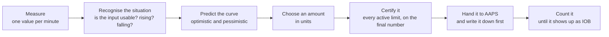

# FUSE — Full-loop Unannounced-disturbance Safety & Exposure Controller

> [!CAUTION]
> **Personal research software — not a supported AndroidAPS distribution, and not a release.**
>
> FUSE is an experimental insulin-dosing algorithm. Since **15.08.2026** it controls a real insulin pump — for exactly **one person (its author), on exactly one pump model, with one CGM**. There is no second user, no independent review, no clinical evaluation, and no defined release criteria that have been met. "In daily use" is a statement about exposure, not about maturity.
>
> Do not build, install, or use this to make treatment decisions unless you own this research fork and understand the code, the current status, and the risks. Every pump model that is not explicitly listed in the source is hard-blocked; that block is empirical (what has actually been run), not a compatibility statement.

<strong>Kurzfassung auf Deutsch</strong> (vollständige Fassung: <a href="#deutsche-kurzfassung">unten</a>)

FUSE entscheidet, **wie viele Einheiten Insulin** abgegeben werden, und verfolgt diese Einheiten anschließend lückenlos — vom Vorschlag über das AAPS-Ergebnis und das Pumpenkommando bis sie als IOB sichtbar werden. Es verstellt **nicht** einen Empfindlichkeitsfaktor und lässt die Dosis daraus entstehen. Seit dem 15.08.2026 läuft FUSE produktiv, aber bei **einem** Anwender auf **einer** Pumpe — das ist kein Freigabestatus. Die ausführliche deutsche Kurzfassung steht am [Ende dieser Seite](#deutsche-kurzfassung).

---

## The one difference, in five sentences

FUSE decides **how many units of insulin to give**, and then tracks those units — from the proposal, through the AAPS result, into the pump command, until they appear as IOB — instead of adjusting an insulin sensitivity factor and letting a dose fall out of it. Because the decision is an amount, every safety limit can be applied to that one final number, rather than to several dose channels that were computed separately and then added up. Because the units are tracked, insulin that was already requested but is not yet visible to AAPS still counts against the next decision — and insulin that provably never reached the pump can be released from the books again, but only against written evidence, never against a timeout. FUSE is built for a **one-minute** glucose signal and for meals that nobody types in: no carbohydrate entry, no meal bolus, no invented COB. Everything else in this document follows from those four points.

The asymmetry that motivates all of it: at one-minute cadence the loop makes over a thousand decisions a day, and **none of them can be taken back**. Withholding basal recovers only a small fraction per hour of what a single bolus delivers in a single minute. What you cannot undo, you had better be able to count.

## How it fails

The design goal is not "always dose less". It is: **never create permission out of missing information.**

| Situation | What FUSE does |
|---|---|
| An input is missing, stale, or implausible | No new positive insulin. The state is named and exported — it never becomes a harmless zero. |
| The books are uncertain (restart, unreadable ledger, failed write) | The liability stays on the books. Uncertain insulin counts as delivered, not as absent. |
| The pump is busy, unknown, or not on the allowlist | No dose. This cannot be overridden — not by the user, not by a meal declaration. |
| The person knows something the model cannot know (a meal is starting) | This *can* be overridden, within a bounded, counted, exported allowance. See [Meals](#meals-one-button-and-what-it-really-does). |

"Fail-closed" here means: FUSE issues no new positive insulin and hands the decision back to the ordinary AAPS pipeline. **The profile basal keeps running.** It does not mean the pump stops.

## What you actually see and operate

Day to day there is nothing to operate. FUSE runs as the APS plugin inside AAPS; home screen, pump, CGM source, and notifications are unchanged.

- **One control: a meal button.** It declares that a meal is starting — not how big it is. It creates no carb entry and no COB. Pressing it opens a three-way dialog (see below).
- **One tab.** A FUSE tab shows the current cycle: state, decision, the limit that actually bound, marker and evidence status, and an entry point to the settings.
- **One record: the trail.** One JSON line per minute cycle is appended to `Documents/aapsLogs/fuse_state_history.jsonl` — signal, state, trajectories, the amount, every limit, the ledger, the pump verdict, plus the build and the rule set the line was produced by. Any question of the form *"why did it do that at 19:07?"* is answered from this file, not from log text. The FUSE modules contain no network code; the trail is written to local storage only.

**What FUSE needs to run at all:** a CGM value **once per minute**. With a five-minute source the premise of the architecture does not hold — the states, ramps, and windows are all defined on minute cadence.

## Words this document uses

Defined here once, used consistently afterwards. The short code names in brackets are what you will find in the source and in the trail.

| Term | What it means |
|---|---|
| **drive** (`r`) | The estimated speed at which something *other than the known insulin* is moving glucose, in mg/dl per minute, signed — positive means being pushed up. Food, hormones, stress, exercise, and sensor drift all land in this one number; FUSE deliberately does not try to label the cause. It is what is left of the observed glucose rate once the calculated effect of the insulin already on board is taken out. |
| **causal filter** | A filter that uses only past values. Common CGM smoothers look at values on both sides of a point — more accurate in hindsight, but the answer arrives late, and a one-minute loop cannot afford that. FUSE only ever uses filters that could have run in real time. |
| **trajectory** | Not one predicted glucose value, but a minute-by-minute curve — and more than one version of it. |
| **lower path** | The pessimistic version of that curve (insulin assumed a little stronger, disturbance a little weaker). Every safety check reads the lower path, and only the lower path. No calculation may quietly swap a friendlier curve into a safety question. |
| **prior-free path** | The curve computed on the assumption that the current rise **stops right now**. It answers the question a closed loop must ask before every meal dose: if the food is already over, is the amount I am about to give still safe? |
| **unit-insulin kernel** | The activity curve of exactly one unit over time, taken from the AAPS insulin model you already have configured. Multiplied by an amount, it gives that amount's future effect. FUSE does not bring its own insulin model. |
| **guard floor** | A glucose level the pessimistic curve is not allowed to fall below. If a dose would push it below, the dose does not stand. |
| **tail liability** | The guard only looks about half an hour ahead. The tail check looks out to the end of insulin action and asks what is still unavoidably on board at that point. |
| **capIOB** | `max(net IOB, bolus IOB)` — the IOB figure the dose limits read. See [Why capIOB exists](#why-capiob-exists). |
| **iobTH** | The boundary between the fast channel and the slow one — **not** a total ceiling. Above it the SMB channel closes; basal keeps running. |
| **commitment ledger** | FUSE's own persistent book of amounts: what it proposed, what left the controller, what AAPS made visible, what is still unresolved. Survives restarts. |
| **transport** | The path from FUSE's decision to the actual pump command. Insulin "in transport" is decided and handed over but not yet visible as IOB. |
| **publication gate** | The check that asks: may this amount leave FUSE and enter the AAPS result — and is it written to disk *before* it leaves? If the write fails, the amount is removed from the result. |
| **pump gate** | An allowlist: may FUSE dose on this pump model at all? Everything unlisted is blocked. |
| **marker** | The meal button — an explicit human statement that a meal is starting. |
| **release envelope** (Hülle) | A fixed number of units that a declared meal may spend *in advance*, before the glucose rise has proved anything. Consumable, exported, restart-safe. |
| **episode** | The bookkeeping unit around one declared meal: one marker press opens one episode, and the episode owns the envelope and the credit. |
| **evidence credit** | Permission earned *after* the fact, from measured, insulin-corrected glucose rise that has not yet been paid for with insulin. It is what carries a meal once the marker's special rights have expired. |
| **deadband** (Totband) | A glucose band below which FUSE deliberately does not chase small unannounced deviations — used at night and after a rebound. |
| **trail** | The per-minute JSONL record described above. |
| **K1 / K2-P / K2-C** | Stage names from the internal specification: K1 observes, K2-P predicts, K2-C decides the amount. Nothing depends on the letters — read them as *observer*, *predictor*, and *controller*. |

## How a dose comes about

The order matters and is enforced: **signal → state → trajectory → amount → channel → actuation**. A later stage may only make the amount **smaller**, never larger, and no stage may invent a number it does not have or step past a safety prerequisite that failed. In practice this means the answer to *"why 0.2 U?"* always has the same shape — this was the signal, this was the state, this was the predicted curve, this amount fitted it, this limit cut it down, this channel delivered it — and each of those six is a separate exported field.

## The layers

### 1. Signal — what is actually happening right now

FUSE reads the causal one-minute filtered value and the raw CGM history and estimates the **drive**: how fast something other than the known insulin is moving glucose. Gaps, stale values, sensor and calibration epochs, implausible jumps, and insufficient history are each their own named state — they are never silently replaced by a plausible-looking number. A measured interval is a checked type, not a convention, so the same measurement can never be counted as evidence twice.

### 2. Observer (K1) — the situation, kept separate from the input quality

The observer runs a small state machine over the glucose dynamics, independent of whether the input is healthy:

| Phase | Meaning |
|---|---|
| `REARMING` | After a reset or a finished episode. Nothing is being tracked; quiet time has to accumulate before the next rise can be detected. |
| `ARMED` | Quiet, watching. |
| `CANDIDATE` | The rate has just crossed the rise threshold but is not confirmed. If it falls back, this aborts straight to `REARMING`. |
| `RISE_ACTIVE` | The rise is confirmed and the event window is running. |
| `CARRY` | The event window has expired but the rate is still above threshold — the rise is lasting longer than the window it was budgeted for. |
| `TURN` | The peak is behind and glucose is coming down, while much of the insulin already given has not acted yet. |

Input **health** (`WARMUP` / `READY` / `DEGRADED`) and **safety** reasons are separate axes. "Rising", "healthy input", and "currently low" therefore cannot overwrite one another in one mixed value — a mistake that is easy to make and very hard to see afterwards.

### 3. Predictor (K2-P) — a curve, in several versions

The predictor builds time-indexed glucose curves from the measured drive, the scheduled profile ISF slots, IOB, insulin activity, and the unit-insulin kernel. It produces a main path, a restrained path, a **prior-free** path, and — if a meal has been declared — a conditional meal path. All of them stay distinguishable in the export. Safety checks read the pessimistic **lower path**; display and demand may read the main path. A declared meal can shape what FUSE *expects*, but it cannot lift the curve that the safety checks are measured against: the guard, clearance, and tail checks all compute against a twin curve from which the meal assumption has been removed.

### 4. Controller (K2-C) — select, then certify

Every cycle answers four questions, in this order — which is also the order in which you read a trail line:

1. **Is there demand at all?**
2. **Which amount fits it?** (a candidate search, in units)
3. **Which limit binds?** — the final amount is checked against three kinds of limit: what the *curve* allows (the guard floor, and the longer-horizon tail check that also counts insulin still to act); what the *insulin budget* allows (the per-cycle SMB cap, the iobTH/maxIOB headroom, and insulin already handed over but not yet visible); and what the *situation* allows (pump increment, meal-episode allowance, deadbands, health gates).
4. **Which channel delivers it?**

The binding limit — the one that actually cut the amount — is exported by name every cycle. Crucially, the limits apply to the **final amount**, not to independently added dose channels: there is one number to certify, not three that each looked reasonable alone.

#### Why capIOB exists

While a zero temp basal is running, AAPS basal IOB goes negative. That is correct bookkeeping — it records insulin *not* given relative to the profile. But if the dose budget were measured against net IOB, withholding basal would silently **create** room for a bolus: the loop would reward itself for having braked, and the harder it braked the more it would be allowed to give. FUSE therefore measures its IOB thresholds against `capIOB = max(net IOB, bolus IOB)`. Net IOB is still calculated, exported, and displayed; it is simply not the number the caps read.

### 5. Channel policy — SMB, protective zero, and the way out of it

The fast channel is a one-minute SMB. **FUSE has no positive temp basal** — the slow positive channel is not built (see [Status](#status)). What the policy does have:

- a real **zero temp basal** when the pessimistic curve is unsafe or the situation is low;
- a **cancel** of a running *positive* temp basal when there is no demand, a cap binds, or health is insufficient — while a negative or zero rate is deliberately kept, because cancelling somebody else's reduction would be an insulin *increase* by doing nothing;
- since 15.08.2026, an **early exit from a protective zero**: as soon as its reason is demonstrably gone in the current cycle (guard above its floor, no safety hold, no tail block, health ready, no ledger hold, no rebound window), the zero is cancelled instead of being left to expire. The only outcome of that path is a cancel — a fall back to profile basal. It can never produce a positive rate. Because a failing cancel would otherwise be retried every single minute (unwelcome radio traffic on a pump that is already struggling), it gives up after a small number of attempts and lets the zero expire; the resulting error direction is then the old one, not a new one.

The reason a dose was blocked is a **typed** value, not free text, and only one of its causes — a protective zero that the model itself decided on — is overridable by a human declaration. Pump busy, invalid input, a missing safety snapshot, a converted extended bolus, or a ledger fault are never overridable: none of them is a judgement call. They are all statements that the machinery is not in a fit state to dose.

### 6. Exposure accounting — the ledger, in both directions

The persistent ledger tracks what FUSE proposed, what passed its publication gate, what AAPS later made visible, and what remains unresolved. Pending insulin is deducted from available headroom **before** it appears in normal IOB. That closes the window in which a pump has already delivered a bolus that AAPS has not yet turned into a treatment — a window that is usually under a minute but has been measured well past ten — and it prevents the same amount from being financed twice across a restart.

**And the opposite error is just as real.** FUSE can decide a bolus, book it, and have the command never reach the pump. The line then stands as a liability, and until it ages out FUSE doses as if insulin were on board that never flowed. The release path therefore reads three *written* facts, never a timeout:

- FUSE's own publication gate stripped the amount from the result and sealed that decision;
- AAPS constrained the amount to exactly zero;
- the code block that commands a bolus was demonstrably never entered while an amount was still outstanding.

A timeout is not evidence that nothing was delivered — it is only the absence of an observation, and the two directions are not symmetric: **too much liability means FUSE doses too little (unpleasant); too little liability means it doses too much (dangerous).**

Alongside the ledger, a delivery journal records the transport itself — attempt, acceptance or refusal, temporary and final pump identifiers, confirmation, proven non-delivery. That is what makes "not visible" distinguishable from "not delivered". If the books are unreadable or contradictory, FUSE enters a **visible hold**: dosing closes, an alarm is raised, and repair is explicit, recorded, and applied at a cycle boundary — never silently at startup.

### 7. Actuation — AAPS remains the pump owner

FUSE produces a normal AAPS `RT`. AAPS still owns constraints, queueing, retries, pump communication, and treatment creation. FUSE does not reimplement a pump driver and **does not modify `pump/**`** — a CI guard checks that on every push, and the diff against the pre-FUSE baseline is empty.

The pump gate is an allowlist with four verdicts: VirtualPump (development), the specifically reviewed Medtrum Nano (the only real pump), a Medtrum whose model could not be identified (blocked, and reported differently from a foreign pump), and everything else (blocked). Medtrum pumps are *patch pumps* — reservoir and electronics are replaced together every few days — so FUSE persists a counter that increases with each new patch. A dose proposed on the old patch can then never be reconciled against a delivery recorded on the new one. (This has nothing to do with software patches.)

## Meals: one button, and what it really does

This is the part outsiders most often misread, so it is spelled out.

**What the button is.** It is a statement by a human being: *a meal is starting now.* It is not a carb entry, not an estimate of size, and it creates no COB. FUSE never invents carbohydrates.

**Why a human may override the model here — and only here.** The person knows something the device cannot know: that food is on the way. They know nothing the device does not know about the pump, the transport, the books, or a missing sensor value. So the marker sits at the end of the model chain as a **floor**, not as a skipped check: it can lift a model judgement (and only two specific "not enough data yet" prediction outcomes), but it can never step past the pump gate, a ledger hold, an invalid input, or a missing safety snapshot.

**The three choices in the dialog.**

1. **With advance release** — the meal is declared and the release envelope may finance insulin before the rise has proved anything.
2. **Without advance release** (*ohne Vorschuss*) — the meal is declared, but the envelope is zero for this episode. Windows, ramps, and deadband openings still apply; no marker-funded insulin. This is deliberately its own recorded state rather than "envelope = 0", so that *declined* stays distinguishable from *spent* in the trail.
**The two dials, and why they are separate.** The envelope says *how much* a declared meal may spend in advance; the release window says *over how many minutes* that amount is handed out. They are set independently, because the same amount behaves differently depending on how fast it arrives: everything in ten minutes gives the earliest possible head start but the largest insulin peak just as absorption begins — which is when the safety floor is most likely to block any follow-up. The same amount over half an hour keeps the head start and flattens that peak. There is deliberately no formula linking the two: a rule like "a longer window automatically permits more insulin" would hide a safety decision inside an arithmetic.

3. **Withdraw** — pressing the button while a marker is active retracts it immediately: no further release, no further credit. **Insulin already delivered is not recovered** — the dialog says so, and the marker line in the graph follows the insulin, not the intention. Withdrawal ends the authorization but not the episode's bookkeeping; otherwise "press by mistake, withdraw, press properly" would finance the same envelope twice.

**The envelope and the window.** The advance release is bounded by an amount (default 1.2 U, configurable up to 4 U) and spread over an adjustable **window** (default 15 min, range 5–45 min) rather than delivered at once. The reason is measured, not theoretical: the same amount pushed out in ten minutes produced an IOB peak that then blocked the guard for hours — precisely while absorption was arriving. Spreading it gives the same head start with a lower peak at the moment it matters. A hard wall-clock ceiling of 45 minutes after the press ends the advance release regardless of settings.

**What happens after the first hour.** The marker's special rights are short-lived: they end as soon as a sustained turn is latched, and in any case after a configurable boost period (default 45 min), while the meal *context* lasts 90 min. The episode itself runs much longer — up to 6 hours. What carries the dosing in between is the **evidence credit**: measured, insulin-corrected rise that has been sealed and not yet paid for with insulin. It is earned from each measurement exactly once, it decays on the wall clock, it is paid out over a window rather than in one lump, and it exists only inside an episode that a human opened. That is why credit is allowed to disarm the night and rebound deadbands — those exist to stop FUSE chasing *unannounced* small deviations, and a declared meal with measured, unpaid rise is the opposite case.

**Night and rebound deadbands.** Below a configurable glucose band, at night and after a rebound, FUSE deliberately does not chase small deviations: at night nobody is awake to correct an error, and the recovery capacity is at its smallest. Where both apply, the *larger* band wins — two protective reasons must never weaken each other. A declared meal lifts the night band; flowing evidence credit lifts both. If you watch FUSE overnight and it looks idle, this is usually why. That is the intended behaviour, not a failure.

**Manual boluses and typed carbs, today.** A manual bolus physically affects everything that reads IOB — the headroom limits and the tail calculation. It does **not** create a meal declaration, an episode, or credit. Typed carbohydrates create no FUSE state at all. The formal HCL semantics are an open contract, not a finished one; see below.

## Status

Since **15.08.2026** FUSE runs on a real pump, for one person, on one pump model. That is a change in exposure, not in maturity.

> In the table below, **"tested"** means *covered by automated tests on the JVM*. It does not mean clinically evaluated, and it does not mean observed to behave well in life. Only the two operation rows describe real-world experience.

| Area | Code status | Field experience |
|---|---|---|
| Causal one-minute input, signal windows, gap and epoch handling | Implemented and tested | In daily use |
| Observer state machine | Implemented and tested | In daily use |
| Trajectory predictor and candidate search | Implemented and tested | In daily use |
| Guard floor, tail liability, iobTH/maxIOB and transport caps | Implemented, tested, exported | In daily use |
| Commitment ledger, delivery journal, hold and repair path | Implemented and tested | In daily use; the hold path has been exercised |
| Proof-based release of never-sent boluses | Implemented and tested | New (15.08.2026), little field data |
| Early exit from a protective zero when its reason is gone | Implemented and tested; switchable off, bit-identical to the previous behaviour | New (15.08.2026), little field data |
| Night and rebound deadbands, evidence credit | Implemented and tested | Days of data only |
| Meal marker, three-way dialog, release envelope and window | Implemented and tested | In use; the envelope/window settings are new |
| Real-pump operation (Medtrum Nano, one user) | Allowlist and patch-epoch contract implemented and reviewed | **Active since 15.08.2026** — not a public release |
| VirtualPump development path | Implemented | Active |
| **Positive FUSE temp basal for slow corrections** | **Not implemented** — deliberate. The fast channel is the one-minute SMB; the only temp-basal outcomes are a protective zero, a cancel, and the early exit from a zero. | — |
| HCL/FCL transition, typed carbs, manual-bolus semantics | Not closed as an architecture contract | — |
| General pump support | Not available; every unlisted real pump is hard-blocked | — |
| Clinical efficacy or safety claim | **None** | — |

Roughly 1300 automated tests across ~100 test classes cover `fuse/**`. That number is not a quality claim: the user interface was for a long time effectively untested, and three UI defects were found by hand on the device rather than by any of them. A static UI-idiom guard now runs in CI, but **the interface counts as checked only after somebody has looked at the device.**

### What FUSE deliberately does not do

- It does not raise basal. There is no positive FUSE temp basal.
- It does not invent carbohydrates, COB, or a meal size.
- It does not support pumps that have not been specifically reviewed, and does not intend to make that list convenient.
- It does not claim delivered insulin can be recovered. It cannot, and the accounting exists because of that.
- It does not treat the absence of an observation as evidence.

## Comparison with the autoISF approach

This table describes **architectural intent**. It is not a claim of proven clinical superiority, and most rows cannot be verified by a reader without running both.

| Concern | autoISF-style architecture | FUSE architecture |
|---|---|---|
| Main control lever | Modifies effective sensitivity and the oref decision inputs | Decides an amount in units, then certifies that one number |
| One-minute CGM | Consumed by an algorithm historically shaped around coarser loop timing | Causal one-minute signal and explicit timing contracts |
| Unannounced meals | Mostly inferred after glucose evidence appears | Onset evidence plus an optional bounded human declaration |
| Negative basal IOB | Can reduce net IOB, and with it apparent exposure | Caps read `capIOB = max(netIOB, bolusIOB)`, so withheld basal creates no SMB budget |
| In-flight insulin | Visible once represented by AAPS IOB/treatments | Persistent conservative transport liability before IOB visibility, released only against written proof |
| Auditability | Logs and result reasons | One versioned JSONL record per minute: signal, trajectories, limits, gates, ledger, build, rule set |
| Pump integration | AAPS-native | Also AAPS-native; no FUSE changes in `pump/**`, enforced in CI |

## Repository map

| Path | Purpose |
|---|---|
| [`fuse/core`](fuse/core) | Pure Kotlin control logic — signal, observer, predictor, controller, marker/episode, ledger, journal. No Android, no AAPS types. |
| [`fuse/plugin`](fuse/plugin) | AAPS adapter, APS plugin, UI, settings, pump gate, persistence, export |
| [`tools/fuse/mahlzeitenlauf.py`](tools/fuse/mahlzeitenlauf.py) | Read-only evaluator for a clean meal run; rejects windows that mix builds or rule sets |
| [`tools/fuse/blocker_entmaskieren.py`](tools/fuse/blocker_entmaskieren.py) | Counter-run tool: which blocker was actually binding? A frequency list of block reasons is not a causal weighting — whichever check fires first hides all the others. |
| [`tools/check_fuse_pump_isolation.sh`](tools/check_fuse_pump_isolation.sh) | CI guard: no FUSE change touches `pump/**` |
| [`tools/check_fuse_ui_idioms.sh`](tools/check_fuse_ui_idioms.sh) | CI guard: static checks on UI idioms |
| [`messungen/`](messungen) | A small number of tracked findings reports. Raw measurement data (`*.jsonl`, `*.json`) is excluded by `.gitignore`. |
| [`FUSE_ARCHITECTURE.md`](FUSE_ARCHITECTURE.md) | Detailed architecture, invariants, data flow, and open design questions |
| [`FUSE_UPSTREAM_PORTING_MATRIX.md`](FUSE_UPSTREAM_PORTING_MATRIX.md) | Every intentional touchpoint outside `fuse/**` and the merge procedure |
| [`.github/workflows/fuse-architecture-ci.yml`](.github/workflows/fuse-architecture-ci.yml) | Pump-isolation guard, UI guard, and test jobs |

**Why this stays mergeable:** FUSE lives in two of its own modules, provably does not touch `pump/**`, and everything else is additive and listed in the porting matrix. A newer AAPS version can be pulled in without rewriting FUSE.

## Branch and version model

- `fuse-dev` is the moving integration branch.
- `3.4.2.5+fuse1.0.0-toni` is the branch on which the author's production line is maintained; `3.4.2.5+fuse0.1.0-toni` remains the frozen earlier line.
- **`1.0.x` means "the author's production line", not "release criteria met".** The built `versionName` moves independently of the branch name — at the time of writing it is `3.4.2.5+fuse1.0.2-toni`. Do not read a version number here as a maturity statement; there are no defined public release criteria yet, and none have been met.
- Only Git tags are immutable evidence points. A branch name that looks like a version is still a moving branch.
- A test data set is identified by `versionName`, Git `HEAD`, the exported `build.committed` flag, and the exported rule-set version — not by a branch name. The rule-set number is maintained **by hand** and says so in the export (`ruleSetVersionIsManual`), so an evaluation must not trust it blindly.

## Development rules

1. **`fuse/core` stays free of Android and AAPS types** — so the dosing logic can be fully tested without a device.
2. **FUSE commits do not modify `pump/**`** — AAPS owns pump transport, and a fork that rewrites the driver cannot follow upstream.
3. **Unknown is never represented as zero, an empty identity, or a harmless default** — a missing value that looks like a valid one is the failure mode that is hardest to see. (An empty serial number once hashed into something that looked like a real identity, and bound the books to nothing.)
4. **Every dose-relevant exit is named and exported** — an unnamed abort cannot be counted, and what cannot be counted cannot be evaluated afterwards.
5. **A proposal is never counted twice** across the candidate, transport, and IOB stages — the same units must not finance two decisions.
6. **New AAPS versions are integrated through the documented additive touchpoints** and the porting matrix; assumptions about upstream code are pinned by static guard tests, because that is where a merge breaks silently.
7. **A UI or log label must not promise more than the data proves** — "meal active" with no credit behind it is a lie that a user will act on.
8. **Structure is durable; numbers are tuning knobs.** Many constants are explicitly marked as working hypotheses. Do not cite a default as a design decision.

For the full contracts and source map, read [FUSE_ARCHITECTURE.md](FUSE_ARCHITECTURE.md).

---

## Deutsche Kurzfassung

> [!CAUTION]
> **Persönliche Forschungssoftware — keine unterstützte AndroidAPS-Variante und keine Freigabe.**
> FUSE steuert seit dem **15.08.2026** eine echte Insulinpumpe — bei **genau einem Menschen (dem Autor), auf genau einem Pumpenmodell, mit einem CGM**. Kein zweiter Anwender, keine unabhängige Prüfung, keine klinische Bewertung, keine erfüllten Freigabekriterien. Produktivbetrieb ist eine Aussage über das **Risiko**, nicht über die **Reife**. Jedes nicht ausdrücklich gelistete Pumpenmodell ist hart gesperrt; diese Liste ist empirisch (was tatsächlich gelaufen ist), keine Kompatibilitätsaussage.

**Der eine Unterschied.** FUSE entscheidet, **wie viele Einheiten** Insulin abgegeben werden, und verfolgt diese Einheiten anschließend — vom Vorschlag über das AAPS-Ergebnis und das Pumpenkommando, bis sie als IOB sichtbar werden — statt einen Empfindlichkeitsfaktor zu verstellen und die Dosis daraus entstehen zu lassen. Weil die Entscheidung eine Menge ist, lässt sich **jede** Grenze auf diese eine Endzahl anwenden statt auf mehrere getrennt aufsummierte Dosiskanäle. Weil die Einheiten verfolgt werden, zählt angefordertes, aber noch nicht sichtbares Insulin schon gegen die nächste Entscheidung — und Insulin, das die Pumpe nachweislich nie erreicht hat, wird wieder entlastet, aber nur gegen **geschriebene Belege**, nie gegen einen Zeitablauf. FUSE ist für **1-Minuten-CGM** und für Mahlzeiten ohne Eingabe gebaut: keine Kohlenhydrate, kein Mahlzeitenbolus, kein erfundenes COB.

**Die Fehlerrichtung.** Das Ziel ist nicht „immer weniger dosieren", sondern: **aus fehlender Information nie eine Erlaubnis machen.** Fehlt ein Eingang, ist die Buchführung unsicher oder die Pumpe nicht freigegeben, gibt es kein neues positives Insulin — das Profilbasal läuft weiter, die Pumpe stoppt nicht.

**Was man sieht und bedient.** Es gibt genau **einen Knopf**: den Mahlzeiten-Marker. Er erklärt, dass eine Mahlzeit beginnt — nicht wie groß sie ist. Dazu einen FUSE-Reiter mit dem laufenden Zyklus und der Zeile, welche Grenze tatsächlich gebunden hat, sowie den **Trail**: eine JSON-Zeile je Minute in `Documents/aapsLogs/fuse_state_history.jsonl`. Das ist die zentrale Beobachtungsquelle; jede Frage „warum hat es um 19:07 das getan?" wird aus dieser Datei beantwortet. Die FUSE-Module enthalten keinen Netzwerkcode.

**Die Schichten.** Signal (kausal, 1 min; Lücken und Epochen sind eigene benannte Zustände) → Beobachter K1 (Phasen `REARMING`/`ARMED`/`CANDIDATE`/`RISE_ACTIVE`/`CARRY`/`TURN`, getrennt von der Eingangsgüte) → Bahnprognose K2-P (mehrere Bahnen; **Sicherheitsprüfungen lesen immer die pessimistische untere Bahn**) → Mengenregler K2-C (erst auswählen, dann gegen jede aktive Grenze zertifizieren; die bindende Grenze steht namentlich im Export) → Kanalpolitik (1-min-SMB, Schutz-Null, Abbruch, **vorzeitiges Beenden einer Null, sobald ihr Grund nachweislich weg ist** — dieser Weg kann nie mehr als Profilbasal freigeben) → Ledger und Transportjournal → Pumpen-Tor und AAPS-native Abgabe.

**capIOB.** Läuft eine Null-TBR, wird das Basal-IOB negativ. Rechnete man die Deckel gegen das Netto-IOB, würde zurückgehaltenes Basal still **neues** SMB-Budget erzeugen — je härter gebremst, desto mehr dürfte abgegeben werden. Deshalb binden die Deckel an `capIOB = max(netIOB, bolusIOB)`.

**Mahlzeiten.** Der Marker ist eine **Autorisierung durch den Menschen**, keine versteckte Kohlenhydrateingabe. Der Mensch weiß etwas, das das Gerät nicht wissen kann (es kommt Essen); er weiß nichts über Pumpe, Transport, Bücher oder fehlende Messwerte — deshalb wirkt der Marker als **Boden am Ende der Modellkette**, nicht als übersprungene Prüfung. Drei Wahlmöglichkeiten: **mit Vorschuss** (die Freigabe-Hülle darf Insulin vorfinanzieren), **ohne Vorschuss** (Mahlzeit erklären, Hülle 0 für diese Episode — Fenster und Entwaffnungen gelten, aber kein markerfinanziertes Insulin; bewusst ein eigener Zustand, damit *abgewählt* im Trail von *verbraucht* unterscheidbar bleibt), und **Rücknahme** (stoppt sofort jede weitere Freigabe; **abgegebenes Insulin wird nicht zurückgeholt**, und die Linie im Graphen folgt dem Insulin, nicht der Absicht). Die Hülle ist einstellbar (Vorgabe 1,2 U, bis 4 U) und wird über ein **einstellbares Fenster** verteilt (Vorgabe 15 min, 5–45 min) statt auf einmal zu fließen — der Anlass ist gemessen: dieselbe Menge in zehn Minuten erzeugte eine IOB-Spitze, die den Wächter danach stundenlang sperrte, genau während die Resorption lief. Nach den Sonderrechten (spätestens 45 min, Kontext 90 min) trägt der **Evidenzkredit** die Episode (bis 6 h): gemessener, insulinbereinigter, versiegelter und noch nicht bezahlter Anstieg. Nur er und ein erklärter Marker entwaffnen die **Totbänder** (Nacht, Rebound) — die gibt es gegen das Jagen *unangekündigter* kleiner Abweichungen; eine ruhige Nacht ist dort gewolltes Verhalten, kein Ausfall.

**Ehrlicher Stand.** Rund 1300 automatische Tests decken die Kernlogik — „getestet" heißt hier **Unit-Tests auf der JVM**, nicht klinisch bewertet und nicht im Alltag bewährt. Die Oberfläche gilt erst nach einem Blick aufs Gerät als geprüft. Offen bzw. bewusst nicht gebaut: **keine positive FUSE-TBR** (der schnelle Kanal ist der 1-min-SMB), **HCL/FCL-Umschaltung, eingetragene Kohlenhydrate und die Semantik manueller Boli** sind als Vertrag nicht geschlossen, **keine allgemeine Pumpenunterstützung**, **keine Wirksamkeits- oder Sicherheitsaussage**. Neu und daher mit wenig Felddaten: der Entlastungskanal für nie gesendete Boli, das vorzeitige Ende der Null-Basal und die Totband-/Evidenzkredit-Schicht. `1.0.x` bezeichnet die Produktivlinie **eines** Anwenders, keinen Freigabestand; der gebaute `versionName` bewegt sich unabhängig vom Branchnamen.

Die ausführliche Architektur mit allen Verträgen und offenen Punkten steht in [FUSE_ARCHITECTURE.md](FUSE_ARCHITECTURE.md).

---

## Upstream and provenance

This repository is based on [AndroidAPS](https://github.com/nightscout/AndroidAPS) and contains the autoISF integration history used as the comparison baseline. Upstream AndroidAPS documentation remains applicable to the surrounding application: [AndroidAPS documentation](https://androidaps.readthedocs.io/). Related autoISF work is documented by [ga-zelle/autoISF](https://github.com/ga-zelle/autoISF) and [T-o-b-i-a-s/AndroidAPS](https://github.com/T-o-b-i-a-s/AndroidAPS).

FUSE-specific behavior is defined by this repository's source code and tests. Research notes and local health data are intentionally not part of the repository — `.gitignore` excludes the raw measurement files under `messungen/`, and only a few findings reports are tracked.
