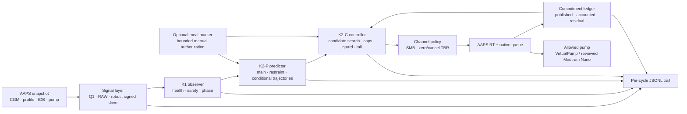

# FUSE — Full-loop Unannounced-disturbance Safety & Exposure Controller

> [!CAUTION]
> **Personal research software — not a supported AndroidAPS distribution.**
> FUSE is an experimental insulin-dosing algorithm under active development. It has not been clinically validated and is not intended for general therapeutic use. Do not build, install, or use it to make treatment decisions unless you are the owner of this research fork and understand the code, the current test status, and the risks.

FUSE is a new APS architecture for **1-minute CGM**, **full closed loop (FCL)** operation, and meals without mandatory carbohydrate or bolus entry. It is not a collection of extra autoISF factors. FUSE separates signal estimation, state recognition, trajectory prediction, dose certification, insulin exposure accounting, and AAPS-native pump actuation into explicit layers.

The project is currently an **alpha research implementation**. The controller runs as a real AAPS APS plugin on a dedicated VirtualPump test system. The code contains a fail-closed pump allowlist for VirtualPump and the specifically reviewed Medtrum Nano path, but this does **not** constitute a public real-pump release or general pump compatibility.

<strong>Kurzfassung auf Deutsch</strong>

FUSE ist eine neue, auf 1-Minuten-CGM und FCL ausgerichtete APS-Architektur. Sie verändert nicht lediglich den ISF, sondern trennt Signalauswertung, Zustandsautomat, Bahnprognose, Mengenzertifizierung, Insulinhaftung und die AAPS-native Pumpenübergabe. Ein optionaler einzelner Mahlzeitenknopf kann eine begrenzte und verbrauchbare frühe Insulinfreigabe autorisieren, ohne Kohlenhydrate oder COB zu erfinden.

Der aktuelle Stand ist ein Alpha-Forschungsplugin. VirtualPump-Livetests laufen; Mahlzeitenpfad, Korrekturpfad inklusive der Frage nach positiver TBR sowie der Wechsel zwischen FCL und HCL sind noch nicht abgeschlossen. Die Medtrum-Nano-Freigabe im Quellcode ist eng begrenzt und keine allgemeine Pumpen- oder Produktionsfreigabe.

Die ausführliche Architektur mit den noch offenen Punkten steht in [FUSE_ARCHITECTURE.md](FUSE_ARCHITECTURE.md).

## Why FUSE exists

FCL without carbohydrate or bolus entry creates a difficult timing problem:

- waiting for a visible glucose rise delays meal insulin;
- reacting strongly to every rise can over-dose corrections and rebounds;
- negative basal IOB can make net IOB look deceptively small;
- insulin already requested but not yet visible in AAPS must not be financed twice;
- a forecast must distinguish missing information from a real zero;
- a one-minute loop needs decisions that are granular, auditable, and reversible where possible.

FUSE addresses these problems with an explicit pipeline and amount-based contracts instead of a single sensitivity multiplier.

## Architecture at a glance

The order is deliberate: **signal → state → trajectory → amount → channel → AAPS actuation**. A later layer may restrict an earlier proposal, but it may not silently invent missing input or bypass a failed safety prerequisite.

## Core ideas

### 1. Causal one-minute signal processing

FUSE uses the native causal Q1 signal and the raw CGM history to estimate a signed disturbance rate. Signal gaps, stale inputs, calibration/sensor epochs, implausible steps, and insufficient history are explicit states—not hidden fallbacks.

### 2. State and health are separate

The observer tracks glucose dynamics (`REARMING`, `ARMED`, `CANDIDATE`, `RISE_ACTIVE`, `CARRY`, `TURN`) independently from input health and safety reasons. “Rising”, “healthy input”, and “currently low” therefore cannot overwrite one another in a single mixed enum.

### 3. Trajectories, not one scalar factor

The predictor builds time-indexed glucose trajectories from the measured drive, scheduled profile ISF slots, IOB, insulin activity, and the unit-insulin kernel. Main, restraint, prior-free, and marker-conditional paths remain distinguishable in the exported evidence.

### 4. One candidate, certified by every active limit

FUSE searches for a dose candidate and then certifies the final amount against the guard floor, tail liability, maxSMB, iobTH/maxIOB headroom, pending transport, episode envelopes, pump increment, and applicable context rules. Limits apply to the final amount rather than to independently added dose channels.

### 5. Exposure is accounted by amount

The persistent commitment ledger tracks what FUSE proposed, what passed its publication gate, what AAPS later made visible, and what remains conservatively unresolved. Pending insulin is deducted from available headroom even before it appears in normal IOB, preventing double financing after restarts or delayed treatment visibility.

### 6. A meal marker is explicit authorization, not hidden carbs

FUSE has one optional meal marker. It does not pretend to know meal size or create COB. It opens a bounded, consumable authorization envelope whose use is exported and restart-safe. The marker can inform conditional meal trajectories, while physical and accounting limits remain explicit. This path is currently being evaluated in clean VirtualPump meal runs.

### 7. AAPS remains the pump owner

FUSE produces a normal AAPS `RT`. AAPS still owns constraints, queueing, retries, pump communication, and treatment creation. FUSE does not reimplement a pump driver. A hard allowlist blocks unreviewed pump models, and patch-epoch binding prevents an old proposal from being reconciled across a known patch change.

## FUSE compared with the autoISF approach

This table describes the architectural intent; it is **not** a claim of proven clinical superiority.

| Concern | autoISF-style architecture | FUSE architecture |
|---|---|---|
| Main control lever | Modifies effective sensitivity and oref decision inputs | Builds explicit state, trajectories, candidate amount, and channel decision |
| One-minute CGM | Consumed by an algorithm historically shaped around coarser loop timing | Causal one-minute signal and timing contracts are first-class |
| Unannounced meals | Mostly inferred after glucose evidence appears | Observer/onset evidence plus an optional bounded manual marker |
| Meal vs correction | Often differentiated through context and factors | Separate correction/rise ratios, episode state, and explicit meal authorization |
| Safety | Distributed gates and prediction rules | Named guard, tail, cap, ledger, pump, and publication contracts |
| Negative basal IOB | Can reduce net IOB | Dose headroom uses `capIOB = max(netIOB, bolusIOB)` so withheld basal does not create SMB budget |
| In-flight insulin | Mainly visible once represented by AAPS IOB/treatments | Persistent conservative transport commitment before normal IOB visibility |
| Auditability | Logs and result reasons | Versioned per-cycle JSONL with build provenance, trajectories, limits, gates, and ledger state |
| Pump integration | AAPS-native | Also AAPS-native; no FUSE changes in `pump/**` |

## Current alpha status

| Area | Status |
|---|---|
| Native one-minute Q1 input, signal windows, gap handling | Implemented and tested |
| Observer state machine | Implemented and tested |
| Trajectory predictor and candidate search | Implemented and tested |
| Guard floor, tail liability, iobTH/maxIOB and transport caps | Implemented and exported |
| Persistent commitment ledger and repair path | Implemented and tested |
| VirtualPump test operation | Active |
| Medtrum Nano allowlist and patch-epoch contract | Implemented and reviewed; not a public release |
| Single meal marker and bounded early-release path | Implemented; clean live evaluation in progress |
| Positive FUSE TBR for slow corrections | **Not implemented**; current Alpha uses SMB plus zero/cancel TBR policy |
| HCL/FCL transition, entered carbs, and manual-bolus semantics | Not yet closed as an architecture contract |
| General pump support | Not available; every unlisted real pump is blocked |
| Clinical efficacy or safety claim | None |

## Repository map

| Path | Purpose |
|---|---|
| [`fuse/core`](fuse/core) | Pure Kotlin control logic: signal, observer, predictor, controller, ledger, journal |
| [`fuse/plugin`](fuse/plugin) | AAPS adapter, APS plugin, UI, pump gate, persistence, export |
| [`tools/fuse/mahlzeitenlauf.py`](tools/fuse/mahlzeitenlauf.py) | Read-only evaluator for a clean meal run; rejects mixed-build windows |
| [`FUSE_ARCHITECTURE.md`](FUSE_ARCHITECTURE.md) | Detailed architecture, invariants, data flow, and open design questions |
| [`FUSE_UPSTREAM_PORTING_MATRIX.md`](FUSE_UPSTREAM_PORTING_MATRIX.md) | Every intentional touchpoint outside `fuse/**` and the merge procedure |
| [`.github/workflows/fuse-architecture-ci.yml`](.github/workflows/fuse-architecture-ci.yml) | Pump-isolation guard, UI guard, and test jobs |

## Branch and version model

- `fuse-dev` is the moving integration branch.
- `3.4.2.5+fuse1.0.0-toni` is the version line cut for the first production installation (15.08.2026); `3.4.2.5+fuse0.1.0-toni` remains the frozen alpha line.
- Only Git tags are immutable evidence points. A branch name that looks like a version is still a moving branch.
- An APK test data set is identified by `versionName`, Git `HEAD`, and the exported `build.committed` flag—not by the branch name alone.
- Future public milestones should use immutable version tags; `1.0.0` would mean the explicitly defined production criteria have been met, not merely that the project builds.

## Development rules

1. `fuse/core` remains independent of Android and AAPS.
2. FUSE commits do not modify `pump/**`; AAPS owns pump transport.
3. Unknown is never represented as zero, an empty identity, or a harmless default.
4. Every dose-relevant exit is named and exported.
5. A proposal is never counted twice across candidate, transport, and IOB stages.
6. New AAPS versions are integrated through the documented additive touchpoints and the porting matrix.
7. A UI or log label must not promise more than the data proves.

For the full contracts and source map, read [FUSE_ARCHITECTURE.md](FUSE_ARCHITECTURE.md).

## Upstream and provenance

This repository is based on [AndroidAPS](https://github.com/nightscout/AndroidAPS) and contains the autoISF integration history used as the comparison baseline. Upstream AndroidAPS documentation remains applicable to the surrounding application: [AndroidAPS documentation](https://androidaps.readthedocs.io/). Related autoISF work is documented by [ga-zelle/autoISF](https://github.com/ga-zelle/autoISF) and [T-o-b-i-a-s/AndroidAPS](https://github.com/T-o-b-i-a-s/AndroidAPS).

FUSE-specific behavior is defined by this repository's source code and tests. Research notes and local health data are intentionally not part of the repository.
